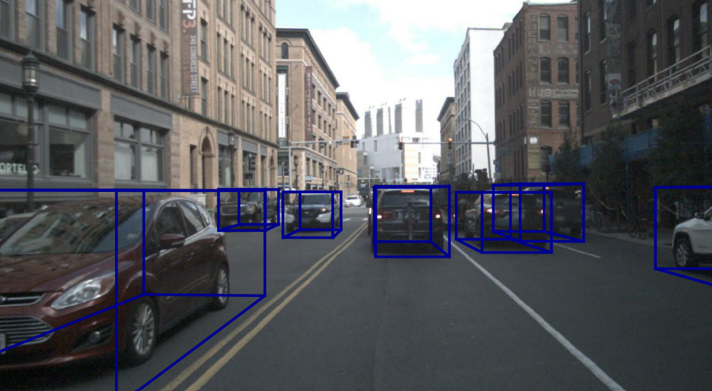
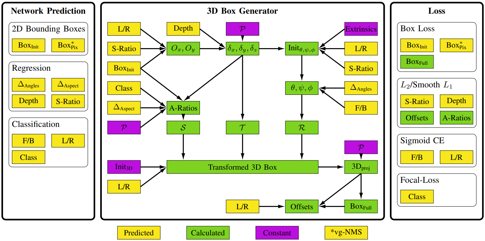
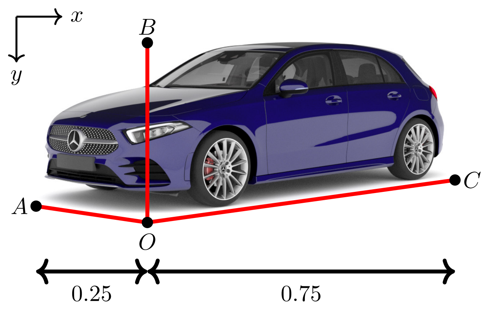
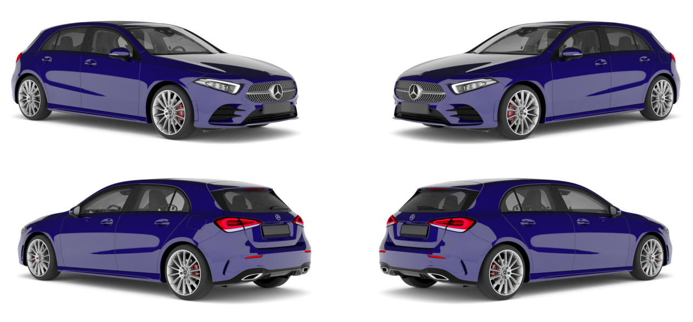
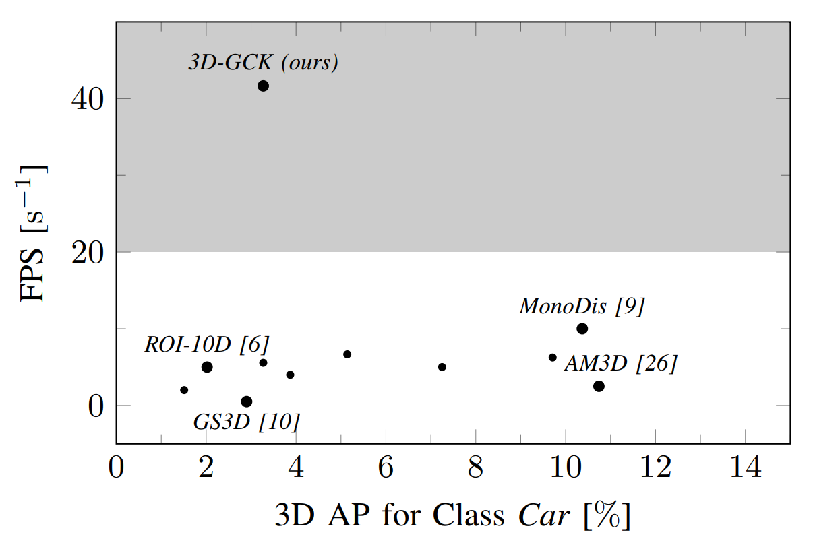
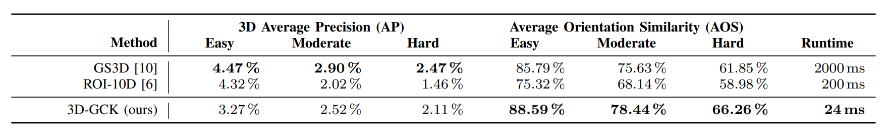
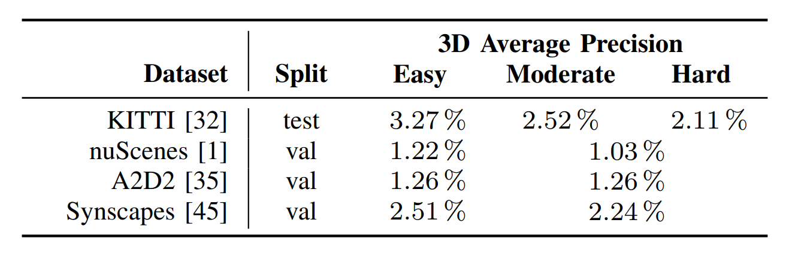
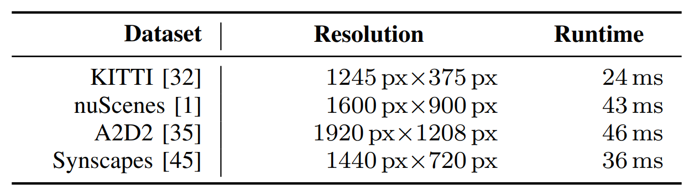

# Single-Shot 3D Detection of Vehicles from Monocular RGB Images via Geometry Constrained Keypoints in Real-Time

------

原文链接：[点这里](https://arxiv.org/abs/2006.13084v1)

## 目录

- [1. 摘要](#1)
- [2. 引言](#2)
- [3. 相关工作](#3)
  - [3.1 基于3D先验边界框生成或损失](#3.1)
  - [3.2 基于几何推理与形状重建](#3.2)
  - [3.3 基于输入数据或特征表示转换](#3.3)
- [4. 模型](#4)
  - [4.1 坐标系](#4.1)
  - [4.2 网络预测](#4.2)
  - [4.3 3D框生成器](#4.3)
- [5. 实验](#5)
  - [5.1 数据](#5.1)
  - [5.2 实验设置](#5.2)
  - [5.3 度量](#5.3)
  - [5.4 结果](#5.4)

## 1. 摘要

提出一种新的3D单目目标检测方法，用于检测单目RGB图像中的车辆。通过预测额外的回归和分类参数将2D检测扩展到3D空间，从而使运行时间接近纯2D目标检测。在几何约束下附加参数转换为网络内的3D边界框关键点。所提方法具有完整的3D描述，包括三个旋转角度，因为是聚焦于图像平面内的某些关键点，所以可以通过无监督方式获取目标的方向。所提方法可以与任何目前的目标检测框架结合，只需很少的计算开销，并举例说明在SSD上如何预测3D边界框。在不同的自动驾驶数据集上测试了该方法；使用KITTI 3D目标检测基准和nuScenes目标检测基准对其进行了评估，都取得了有竞争力的结果。在所有测试数据集和图像分辨率方面都优于SOTA方法，速度超过20 FPS。

## 2. 引言

目标检测（2D/3D）是自动驾驶系统的关键，正在开发的自动驾驶汽车和配有先进驾驶辅助系统的消费级汽车都配备了一套传感器，如RGB相机、激光雷达、雷达等系统。激光雷达传感器测距精确，出框稳定，但是成本高。RGB图像提供了丰富的语义信息，但缺乏深度信息。因此，神经网络需要从单目RGB图像精确估计深度，并且要保证算法的实时性。

提出3D-GCK方法，能预测包含三个旋转角的完整3D边界框描述。只关注图像平面中的关键点，利用投影特性生成3D方向信息，因此不需要gt带有旋转角度信息。

使用一个标准的2D目标检测框架，添加所述扩展，将预测所得2D边界框扩展到3D空间。从2D到3D可以用最小的计算开销完成，实现实时性能。

总结贡献：

1）可以用SOTA 2D目标检测框架，将检测所得2D边界框扩展到3D；

2）用SSD举例说明所提3D-GCK框架的实用性；

3）在4种自动驾驶数据集上测试3D-GCK，KITTI、nuScenes、A2D2、Synscapes。

在nuScenes上的测试结果如下：

## 3. 相关工作

三类单目3D目标检测方法：

1）基于3D先验边界框生成或损失；

2）基于几何推理与形状重建；

3）基于输入数据或特征表示转换。

### 3.1 基于3D先验边界框生成或损失

Mono3D基于类语义、轮廓、形状和位置先验的预测，尽可能多的生成3D区域建议，但推理速度缓慢。ROI-10D连接2D RPN的输出特征与可微ROI lifting层中的depth网络的输出特征。这些特征用于生成稀疏的3D先验框，先验框在3D空间中根据实际进行优化。文7利用2D先验边界框做物体质心估计、预测点云做物体尺度和形状估计，提出了3D边界框先验。M3D-RPN通过预计算每个先验3D参数的平均统计信息，同时创建2D和3D边界框先验；并使用2D卷积的非共享权重学习特定位置的特征，以联合预测的2D和3D框。文9通过分离不同参数的依赖关系，执行二阶段3D目标检测。这是在loss-level单独处理参数组实现的。

与本文最相关的是GS3D，从2D图像平面提取可见表面特征，透视投影到规则形状。与2D边界框特征相结合，这些特征随后用于根据2D边界框的类别、大小和局部方向的估计来细化粗糙的初始3D边界框建议。

与GS3D相比，本文的关键点表示具有双重功能。首先利用2D图像平面知识增强3D边界框的初始化，基于此动态确定3D边界框的先验全局方向和尺寸。此外这些关键点被用作几何约束，来优化3D边界框估计。

### 3.2 基于几何推理与形状重建

几何通常被用作3D目标检测问题的一个约束。Deep3DBox和Shift R-CNN利用预测所得2D边界框提供的平移约束，通过使用线性方程组强制预测所得3D边界框在2D边界框内紧密配合。除了预测3D目标的尺寸和方向外，文13还对视点做分类，并在3D边界框底面的中心投影上做回归，用于将3D边界框的投影联合拟合到预测所得2D边界框。Mono3D++通过优化粗略表示的3D边界框和细粒度可变形线框来执行3D车辆检测。为此使用地平面假设和车辆形状先验。MonoGRNet没有做逐像素深度估计，而是对3D检测执行实例深度估计。它探索几何特征，通过基于估计所得深度，将估计所得3D中心的2D投影反投到三维空间来精细化目标的三维中心位置。文16使用多视图表达将投影的3D边界框回归到2D。

在BS3D中，由四个粗略约束的关键点组成的边界形状表示是端到端学习的，用于在后处理步骤重建3D边界框。文18预测14个预定义2D关键点的坐标和可见状态，并基于多bin分类估计局部方向。然后学习2D关键点和其在3D CAD模型上标注的3D关键点的对应关系，解决目标定位问题。在从粗到精的定位过程中，DeepManta使用3D CAD模型和带标注的3D部分。文20通过探索反向图形，联合学习非模态的3D形状与姿态。

本文直接从3D边界框顶点集中选择四个关键点，不依赖目标级别的关键点，不依赖任何CAD模型。这四个选定的关键点用作几何约束，联合优化3D边界框检测的定位、尺寸和三维方向。

### 3.3 基于输入数据或特征表示转换

通过直接转换输入数据表示或特征表示，可以方便地进行3D目标检测，如从单目RGB图像到3D伪点云。文21在利用相机的外部参数和惯性测量单元信息校正ego车辆的运动变化后，通过将正面图像投影到鸟瞰图（BEV）图像上，恢复距离信息。然后使用Yolov3确定目标的类别、位置、宽度和高度以及方向。文22使用GAN生成3D数据。文24、25重点关注使用立体视差估计生成伪点云。文26在相机校准的帮助下将估计深度转换为点云，然后使用多模式特征融合模块将互补RGB提示嵌入生成的点云表示中。文27根据输入图像中生成的伪点云和2D目标建议提取一组点云锥台，并将其传递给SOTA两阶段激光雷达3D边界框检测器。文29介绍了一种正交特征变换操作，该操作使用基于图像特征映射的特征填充3D体素特征映射。文30对3D目标检测的特征和数据表示进行多级融合。

## 4. 模型

虽然标准2D目标检测框架仅基于分类和边界框回归部分构建，但需要进行一些调整才能将2D边界框扩展到3D边界框。下图显示了关于在本文网络结构中使用附加预测模块的概述。此外还描述了使用这些预测及其相应的损失函数生成3D边界框所需的步骤。

3D-GCK采用三步方案将2D检测扩展到3D：

1） D边界框初始化估计。

2） 宽高比和尺寸的细化。

3） 旋转角度的细化。

### 4.1 坐标系

如下图所示，为感兴趣的目标定义一个坐标系。O位于目标底部，并被选为离相机最近的点。A定义对象相对于O的宽度，B和C分别用于确定对象的高度和长度。

### 4.2 网络预测

3D-GCK有3种不同类型的预测模块：

#### 2D边界框

Box(Init)是一个标准的四参数2D边界框回归器，由Ax、By、Cx、Oy定义。此外，训练Box(Pix)仅预测实际车辆的可见部分。然而此边界框回归器仅使用vg-NMS在基础2D目标检测框架中选择最佳2D预测，但对于实际3D边界框生成不是强制性的。

#### 回归

除了标准2D边界框回归，3D-GCK还回归了多个附加参数。

边长比（S-Ratio）确定了车辆侧面相对于前面或后面的可见程度，取值范围在0-1之间。该值用于初始化生成的实际3D边界框的偏航角（yaw）。动态计算初始偏航角时，初始俯仰角和翻滚角按相机外参而定。

在下一步中，将细化初始角度。∆(Angles)是一个三维向量，表示这些最初计算的3D方向的偏移量（以弧度为单位）。∆(Aspect)是一个二维向量，用于调整纵横比w/h和l/h，其中l、h、w分别表示对象的长度、高度和宽度。

由于3D边界框需要有效的深度，并且3D-GCK仅对单目RGB图像操作，因此也需要估计边界框的深度。为此，要估计从相机到车辆原点O的逆欧氏距离。

#### 分类

除了实际目标的分类外，在3D-GCK中还执行了另外两个分类。F/B是一种二元分类，经过训练用于预测车辆前部（F）或后部（B）是否可见。此分类简化了偏航计算，因为边界框必须在偏航轴上旋转+π，这取决于前方或后方是否可见。此外，L/R将汽车的侧面与其前或后面相比是左侧还是右侧。F/B和L/R分类如下图所示。

### 4.3 3D框生成器

在3D-GCK结构的3D框生成器中，每次检测时预测参数都会转换为真实的3D边界框。为此计算了代表缩放S、平移T和旋转R的三个矩阵。

## 5. 实验

### 5.1 数据

选用几个自动驾驶数据集评估3D-GCK。

KITTI包含约15k幅图像，但分辨率相当小；nuScenes有40k个带注释的帧，包含1k个不同的场景；A2D2有12k个带注释的帧。

Synscapes是一个合成数据集，包含25k张照片真实感渲染图像。提供3D目标的完整描述，包括俯仰和翻滚方向。

A2D2和Synscapes不提供正式的trainval分配方式和测试集，本文自行分配。80%训练，20%做评估，确保所有图像必在train或val中。

### 5.2 实验设置

InceptionV1为backbone。根据实验调整优化器、不同loss weights的权重、学习率衰减策略。

### 5.3 度量

KITTI目标检测基准：3D Average Precision (AP)。对于车辆，需要至少70%的IoU才能将3D边界框视为真正（TP）。

Average Orientation Similarity (AOS)用于评估3D-GCK的方向预测能力。

nuScenes：2D中心距离d低于某个阈值，则被视为TP。

### 5.4 结果

速度快

不同方法的对比

不同数据集上的测试结果

运行时间

