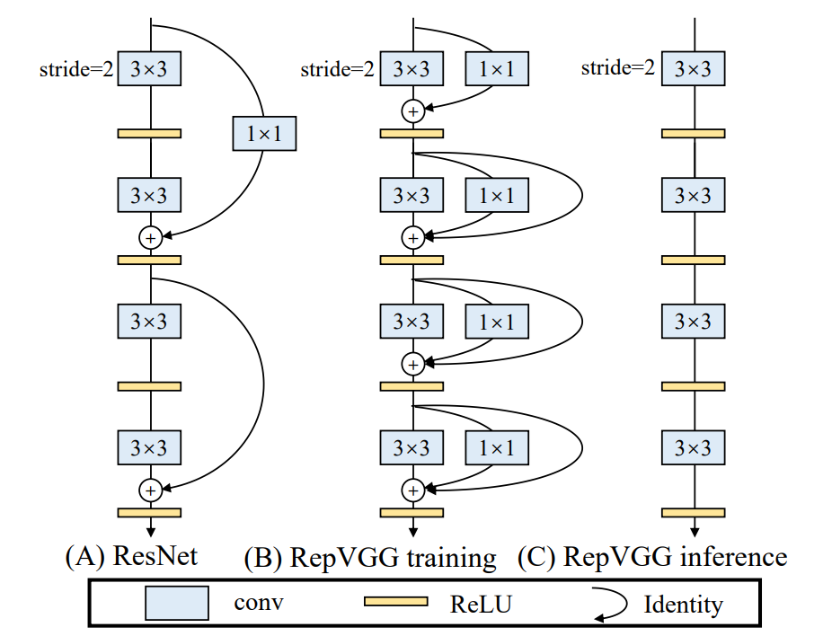
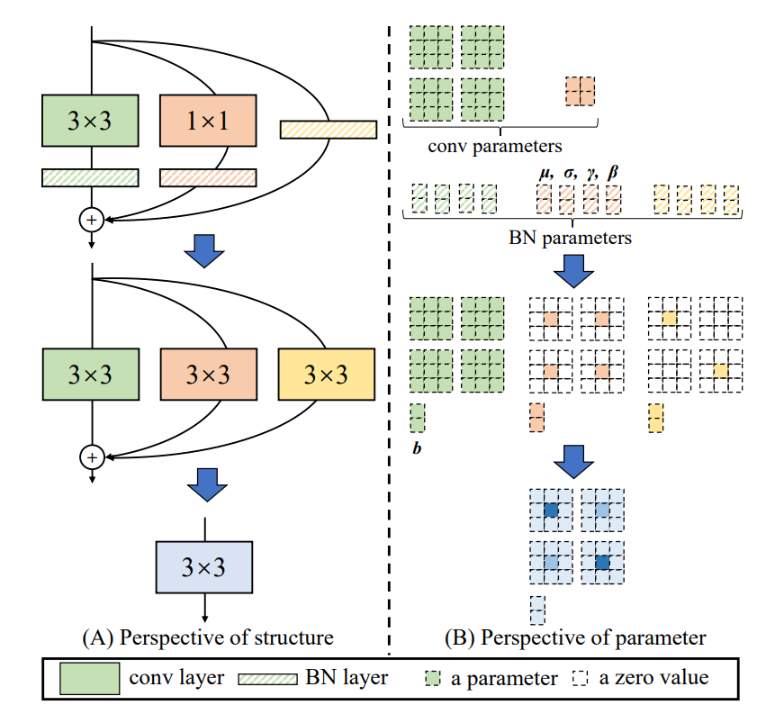
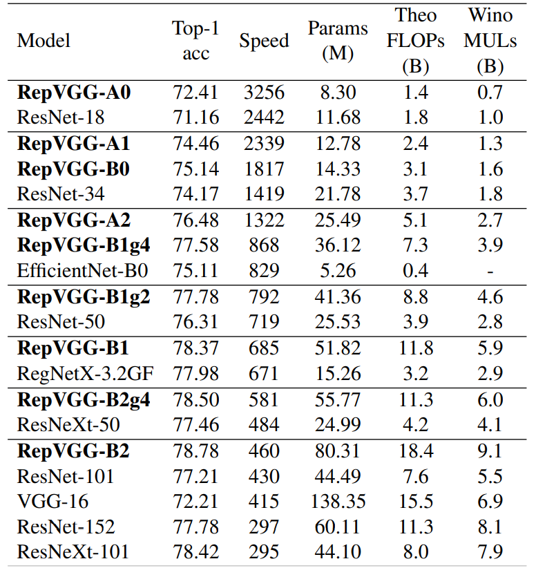

# RepVGG系列

------

原文链接：[点这里](https://arxiv.org/abs/2101.03697)

## 目录

- [1. 摘要](#1)
- [2. 介绍](#2)
- [3. 方法](#3)
- [4. 实验](#4)
  - [4.1 图像分类](#4.1)
- [5. 总结](#5)

## 1. 摘要

提出了一种简单但强大的卷积神经网络结构，该结构有一个类似VGG的推理时间主体，此主体仅由3*3卷积和ReLU堆叠组成，而训练时间模型有一个多分支的拓扑结构。训练时间结构和推理时间结构的解耦是通过结构重新参数化技术实现的，因此该模型称为RepVGG。在ImageNet上，RepVGG的top-1精确度达到80％以上。在NVIDIA 1080Ti GPU上，RepVGG模型的运行速度比ResNet-50快83％，比ResNet-101快101％，与最先进的模型相比，具有更高的精度并显示出了良好的精度与速度的平衡。

## 2. 介绍

经典的卷积神经网络VGG结构简单，由Conv、ReLU和Pooling组成，在图像识别方面取得了巨大的成功。随着Inception、ResNet和DenseNet的出现，许多研究兴趣转移到了设计良好的结构上，这使得模型越来越复杂。虽然许多复杂网络比简单网络能提供更高的精度，但缺点是显著的。1）复杂的多分支设计使得模型难以实现和定制，降低了推理速度和内存利用率。2）某些组件增加了内存访问成本，并且许多设备不支持此操作。影响推理速度的因素有很多，FLOPs的数量并不能准确反映实际速度。尽管一些新模型比老模型有更低的FLOPs，但它们的运行速度可能不会更快。因此VGG和Resnet的原始版本仍然大量应用于学术界和工业界。

本文提出了RepVGG网络，是一种VGG风格的结构，具有以下优点：

- 有类似VGG的平面拓扑结构，没有任何分支

- 模型主体仅使用3×3 conv和ReLU

- 实例化结构，没有复杂的设计

与其他模型的对比图如下：

## 3. 方法

网络结构如下图所示。

提出通过结构重新参数化将训练时间多分支结构与推理时间简单结构解耦，即通过转换其参数将一个结构转换为另一个结构。具体而言，一个网络结构与一组参数耦合，如果某个结构的参数可以转换为与另一个结构耦合的另一组参数，我们可以用后者等价地替换前者，从而改变整个网络结构。

受ResNet启发，用identity和1×1分支构造训练时间RepVGG，再通过结构重新参数化移除分支。一个恒等分支可以看作是一个退化的1×1 conv，后者可以进一步看作是一个退化的3×3 conv。因此可以将一个3×3 conv，identity和1×1 conv以及BN层构造成一个3×3 conv。

结构重新参数化如下图所示。

内存访问成本（MAC）和并行程度会影响推理速度。MAC在group-wise conv中占很大一部分时间；在相同的FLOPs下，具有高并行度的模型可能比具有低并行度的模型快得多；碎片化操作对具有强大并行计算能力的设备（如GPU）来说是不友好的，并且会带来额外的开销。

## 4. 实验

### 4.1 图像分类

图像分类选用了ImageNet数据集，相比目前主流的网络，RepVGG显示出良好的性能。

| Model     | Top-1 acc | Speed | Params (M) | Theo FLOPs (B) | Wino MULs (B) |
| --------- | --------- | ----- | ---------- | -------------- | ------------- |
| RepVGG-A0 | 72.41     | 3256  | 8.30       | 1.4            | 0.7           |
| ResNet-18 | 71.16     | 2442  | 11.68      | 1.8            | 1.0           |
| RepVGG-A1 | 74.46     | 2339  | 12.78      | 2.4            | 1.3           |
| RepVGG-B0 |           |       |            |                |               |
| ResNet-34 |           |       |            |                |               |
|           |           |       |            |                |               |
|           |           |       |            |                |               |
|           |           |       |            |                |               |
|           |           |       |            |                |               |
|           |           |       |            |                |               |
|           |           |       |            |                |               |
|           |           |       |            |                |               |
|           |           |       |            |                |               |
|           |           |       |            |                |               |
|           |           |       |            |                |               |
|           |           |       |            |                |               |
|           |           |       |            |                |               |
|           |           |       |            |                |               |
|           |           |       |            |                |               |

## 5. 总结

## 精度、FLOPS和参数量

| Models | Top1 | Top5 | Reference top1| FLOPS (G) |
|:--:|:--:|:--:|:--:|:--:|
| RepVGG_A0 | 0.7131 | 0.9016 | 0.7241 |     |
| RepVGG_A1 | 0.7380 | 0.9146 | 0.7446 |     |
| RepVGG_A2 | 0.7571 | 0.9264 | 0.7648 |     |
| RepVGG_B0 | 0.7450 | 0.9213 | 0.7514 |     |
| RepVGG_B1 | 0.7773 | 0.9385 | 0.7837 |     |
| RepVGG_B2 | 0.7813 | 0.9410 | 0.7878 |     |
| RepVGG_B1g2 | 0.7732 | 0.9359 | 0.7778 |    |
| RepVGG_B1g4 | 0.7675 | 0.9335 | 0.7758 |    |
| RepVGG_B2g4 | 0.7881 | 0.9448 | 0.7938 |    |
| RepVGG_B3g4 | 0.7965 | 0.9485 | 0.8021 |    |

