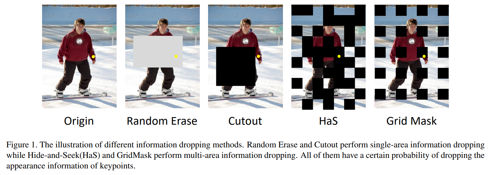
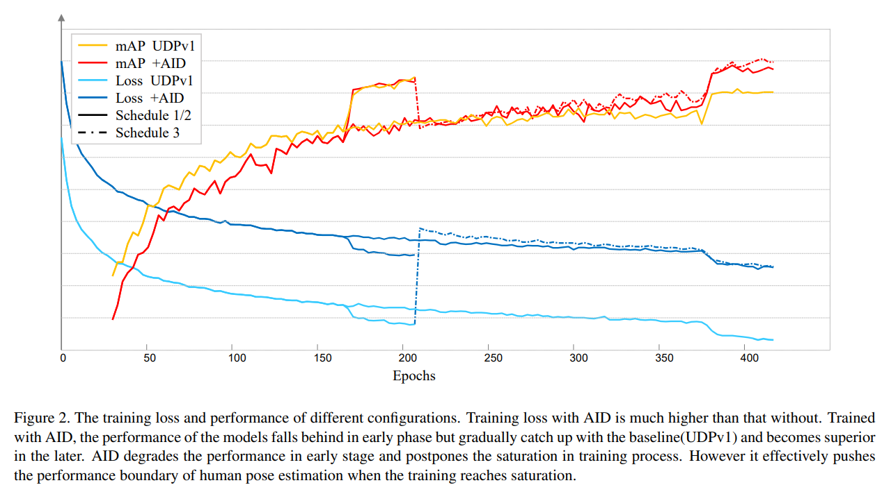
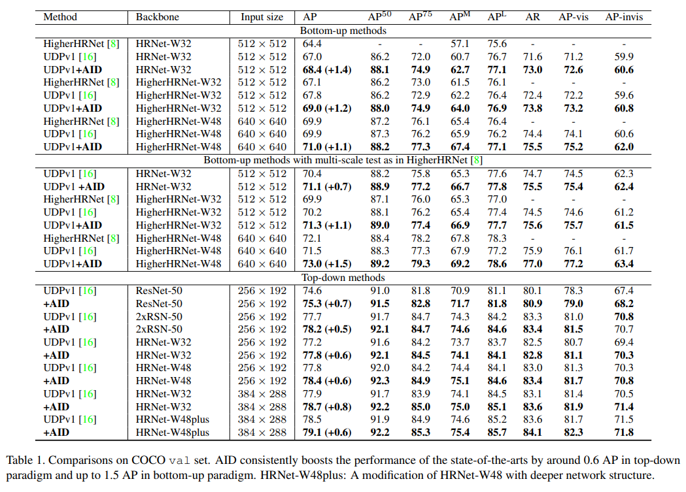
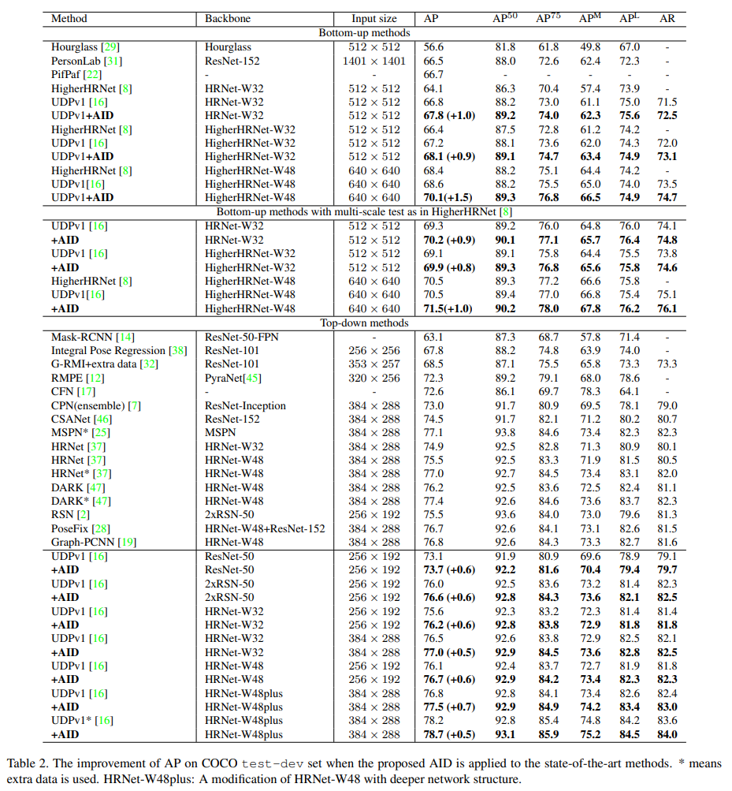
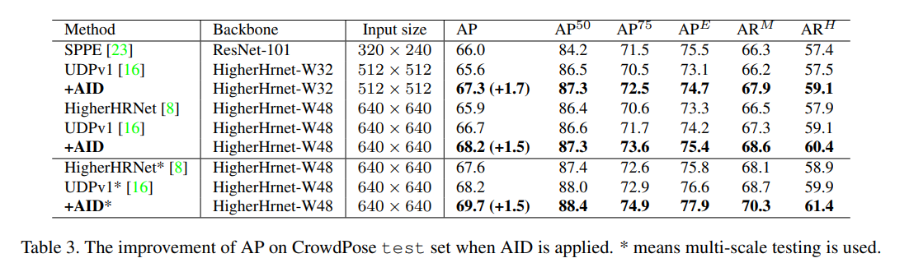
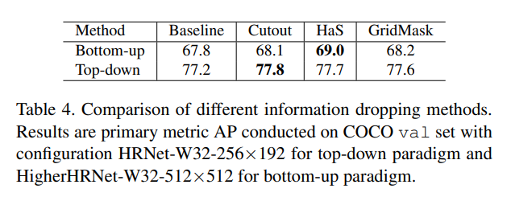
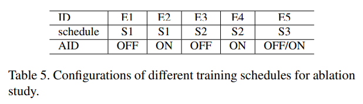
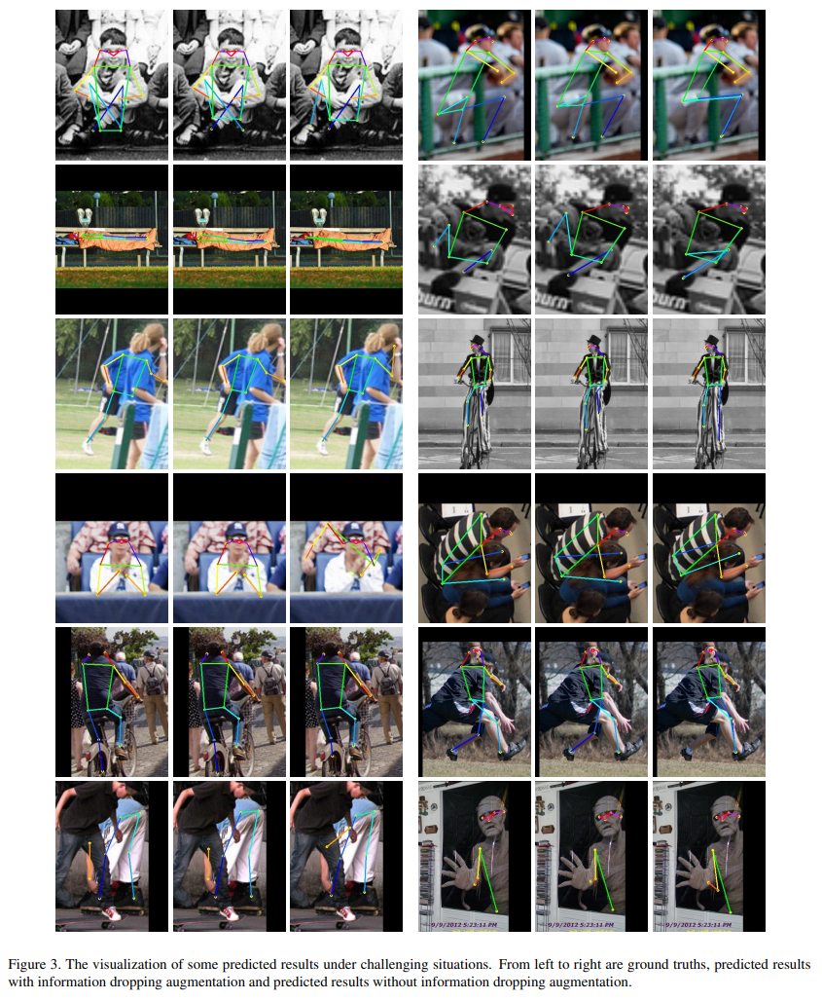

# AID: Pushing the Performance Boundary of Human Pose Estimation with Information Dropping Augmentation

------

原文链接：[点这里](https://arxiv.org/abs/2008.07139)

## 目录

- [1. 摘要](#1)
- [2. 介绍](#2)
- [3. 相关工作](#3)
  - [3.1 人体姿态估计](#3.1)
  - [3.2 信息丢弃](#3.2)

- [4. 方法论](#4)
  - [4.1 人体姿态估计AID](#4.1)
  - [4.2 AID训练schedule](#4.2)
- [5. 实验](#5)
  - [5.1 COCO](#5.1)
  - [5.2 CrowdPose](#5.2)
  - [5.3 消融实验](#5.3)
    - [5.3.1 信息丢弃方法](#5.3.1)
    - [5.3.2 训练schedule](#5.3.2)
    - [5.3.3 定性比较](#5.3.3)
- [6. 结论及未来工作](#6)

## 1. 摘要

外观信息和约束信息对人体姿态估计都至关重要。然而现有工作有一种倾向，过度拟合前者而忽略后者。本文提出信息丢弃增强（AID）来验证和解决这一问题。作为有效开发AID潜能的前提，本文针对AID定制了训练schedule，从信息供给角度分析训练过程中的loss和性能模式来进行设计。作为一种模型不可知方法，AID对自顶向下和自底向上的SOTA方法都做了各种实验，包括不同的输入尺寸、框架、主干、训练集和测试集。在COCO人体姿态估计测试集上，加入AID后，自顶向下方法性能提升约0.6 AP，自底向上方法性能提升约1.5 AP。在CrowdPose数据集上，性能提升超过了1.5 AP。由于AID将人体姿态估计问题的性能边界大幅提升，并开创了新的技术水平，本文希望AID能够成为训练人体姿态估计器的常规配置。

## 2. 介绍

人体姿态估计服务于许多视觉理解任务，如视频监控和动作识别。近年来见证了从单人到多人姿态估计的重大进展，其中主要包括网络结构演化，无偏数据处理和有效的分组策略。

本文会关注可能出现的过拟合问题，这是在重新思考手工标注方法和模型监督训练之间关系时提出的一个猜测。用于人体关键点定位的基本信息是外观信息。这促使先驱们使用了响应图（其中心恰好是关键点）作为人体姿态估计训练过程的监督信息。响应图监督很直观，并在许多研究工作中被证明是有效的。另外一个信息是约束信息，如人体自身关键点之间的关系或人体与其周围环境之间的相互作用。约束信息使得在一些缺乏外观信息的场景中依然能够定位关键点，如左右膝盖之间的遮挡或模糊。虽然神经网络具有从训练数据中学习的潜力，但检测器仍然很难学得约束信息。相比之下，外观信息对卷积网络来说更加直观且更容易获得。当外观信息始终存在，且忽略约束信息不会受到惩罚时，本文怀疑仅使用响应图来进行监督的算法有过拟合外观信息的倾向。

基于上述分析，本文引入信息丢弃方法来验证这个猜测，并间接迫使神经网络专注于学习约束信息。信息丢弃是一种常用的正则化方法，并已广泛应用于许多其他问题。通过丢掉图像的一些信息，可以使神经网络学习如何鉴别特征，从而显著提高模型的鲁棒性。受此启发，本文会随机丢弃一个关键点的外观信息，并维持响应图做监督，目的是防止经过训练的估计器过拟合外观信息，使其更加关注约束信息。本文称此实现为信息丢弃增强（AID）。

虽然AID在理论上更多地关注了约束信息，但如果使用通用的训练schedule，可能并不起作用，甚至会使结果更差。通过观察训练过程的loss和性能，本文发现AID使标准学习过程更具挑战性。具体来说，AID造成的外观信息缺失会影响网络学习。为了解决这一问题，本文提出两种定制训练schedule，以此提高人体姿态估计性能。

实验部分，自顶向下和自底向上的SOTA方法中都应用了AID。在不同的输入尺寸、框架、主干、训练集和测试集下，AID都能成功地将人体姿态估计的性能边界提升到可观且稳定的水平。在COCO测试集上，自顶向下方法性能提升约0.6 AP，自底向上方法性能提升约1.5 AP。在CrowdPose数据集上，性能提升超过了1.5 AP。实验结果不仅验证了响应图监督的潜在缺陷，还证明了AID在性能改进方面在总体上是有效的。基于这些结果，本文建议将AID作为训练人体姿态估计器的常用配置，它与随机翻转、随机缩放和随机旋转地位相同。除了针对信息丢弃和训练schedule的消融实验外，本文还提供一些如何使用AID的指南。

本文的主要贡献总结如下：

1. 本文首先确定了人体姿态估计中外观信息的过拟合问题，并引入了信息丢弃增强（AID）来验证和解决这一问题。

2. 从信息缺失的角度分析，为何在现有研究中加入AID并不起作用。为此本文提出定制的训练schedule，与AID配合使用，以此提高模型性能。

3. 通过充分的实验，本文展示了AID成功突破了人体姿态估计问题的性能边界，并设定出一个新的SOTA baseline。因此希望AID能成为训练人体姿态估计器的常规配置。

## 3. 相关工作

### 3.1 人体姿态估计

**自底向上方法**    首先检测出所有人体关键点，然后将这些关键点分配给每个具体实例。此类方法大都关注分组问题。OpenPose开启了另一个分支，集中关注分组关键点之间的成对关系（部位亲疏关系）。AssociativeEmbedding仅根据嵌入向量对关键点进行分组，嵌入向量是通过heatmap单独学习的。文22提出学习部位强度场，旨在精确定位小目标。MultipleSenet同时实现人体检测和姿态估计，提出PRN来根据每个人的边界框对关键点进行分组。以高计算量为代价，HigherHRNet维持了高分辨率特征图，主要通过减少UDP中所述的系统误差，有效提高预测精度。文11用可微分层图代替后处理分组，实现多人姿态估计的端到端学习。

**自顶向下方法**    通过两个阶段实现多人姿态估计：使用人体检测器检测人体边界框，感知这些框内的各个关键点位置。主干网络结构是这种方法主要考虑的因素。CPN和MSPN分别是2017年和2018年COCO Keypoint Challenge的SOTA方法，其主要思想是使用级联网络细化关键点预测。随后，RSN针对MSPN网络结构设计了Res-Steps-Net单元和姿态优化器来学习精细局部表示。SimpleBasline提出了一个简单但有效的范例，通过添加几个反卷积层来扩大输出特征的分辨率。HRNet在整体结构上保持了高分辨率表示，在公开数据集上实现SOTA性能。Mask R-CNN通过构建端到端框架，在性能和推理速度之间实现了良好的平衡。PoseFix被设计为一个后处理模块，用于学习修正现有方法中的错误。类似地，Graph-PCNN设计了一个额外的细化阶段，该阶段修改了局部特征，并考虑了关键点之间的关系。近期，一些其他工作在人体姿态估计的数据处理方面有所关注。DARK通过设计一种分布感知方法实现了高精度解码。UDP判定现有方法中的偏差数据处理，为人体姿态估计问题生成了更高、更可靠的baseline，为2020年COCO关键点挑战赛冠军解决方案奠定了坚实的基础。

一些前期工作在神经网络构建或后处理中明确使用了约束信息。通过使用预定义姿态图和复杂神经网络结构，设计了Cascade Prediction Fusion和Pose Graph Neural Network，发掘潜在的上下文信息。OpenPose构建了一种包含两个分支的模型，用于预测关键点heatmap和他们之间的成对关系(部位关联场)。部位关联场显式学习约束信息，并用于关键点分组过程。这种约束信息是否能促进响应图预测还有待研究。在使用约束信息时，上述方法只关注了人体模型，很少考虑目标与环境之间的相互作用。

### 3.2 信息丢弃

作为一种有效的正则化方法，信息丢弃(dropping)已成为许多任务的常用训练策略，如行人重识别、人脸识别、分类和目标检测。用于深度学习的信息丢弃源于Random erase和Cutout。近期，hide-and-seek (HaS)和GridMask分别提出了两种多区域信息丢弃策略，在分类问题中取得了更好的正则化效果。

在人体姿态估计问题中，信息丢弃增强并不是一种流行的范式，并且大多数SOTA方法都不会采用。文20倡导关键点掩膜训练，旨在模拟不同的遮挡情况，但改进忽略不计。文34进行了彻底的实验，以证明遮挡增强对于人体姿态估计不是必要的，在某些情况下不会改善性能，甚至会降低性能。在进行信息丢弃或信息干扰增强的消融实验时，前期工作使用了相同的训练schedule进行公平比较。本文从训练过程中信息供给的角度对此进行分析，并得出结论：在有无信息丢弃的对比训练中，最佳schedule是不同的。

## 4. 方法论

### 4.1 人体姿态估计AID

信息丢弃思想是随机丢弃一些标注了关键点的外观信息，在保持响应图监督的同时，避免训练出现过拟合。Random erase和Cutout通过在图像平面中以一个随机位置为中心，丢弃单个连续区域来实现这一点。相比之下，HaS和GridMask执行多区域信息丢弃。HaS首先将图像分割成小块，然后以一定的概率丢弃其中一些。GridMask根据由均匀分布的正方形构成的规则掩膜丢弃外观信息。上述所有方法都有一定概率丢弃关键点的外观信息，但对性能有不同的影响。根据初步实验结果，Cutout是自顶向下范式的最优方法，HaS是自底向上范式的最优方法。

### 4.2 AID训练schedule

优化schedule对于训练高性能姿态估计网络具有重要意义。根据经验，在训练过程中直接应用AID甚至会降低姿态估计器的性能。通过消融实验，本文观察了训练过程中loss和性能的变化。使用AID训练时loss要更高，并且在早期训练过程中性能会滞后，但随后逐渐上升。基于这一观察，本文认为AID导致的外观信息不足干扰了早期学习，延迟了拟合速度。因此，添加AID训练人体姿态估计器需要更长的schedule。

本文提出两种简单有效的方法解决上述困境。一是将训练schedule加倍，为网络留出足够的时间来克服困难。另一种是将训练过程分为两个阶段：训练开始时与之前一样使用没有AID的通用schedule，随后在其基础上加入AID做额外的细化schedule。第二种方法的主要优点是可以复用前期工作中已经训练好的模型，以节约计算资源。根据经验，上述两种训练schedule具有相似的效果，并且算法可以从中获得适当的提升。

## 5. 实验

### 5.1 COCO

**实施细节**    模型在COCO train子集上训练，该子集包含约57000张图像共150000个实例。在val数据集和test-dev数据集上评估训练后的模型，两个数据集分别包含月5000张图像和20000张图像。AP评估指标基于目标关键点相似度(OKS)报告得出。本文使用UDPv1作为数据处理指南，并严格按照HRNet-UDPv1为所有结构设置训练配置。实验使用SOTA主干网络，包括SimpleBaseline、HRNet和RSN，用于自顶向下范式；HRNet和HigherHRNet用于自底向上范式。在推理过程中，HTC检测器用于为自顶向下范式（如UDP）检测出人体实例。经过多尺度测试，COCO val数据集上80类和人体单类的AP分别是52.9和65.1。本文报告了单个模型的性能，并且只使用翻转测试策略。

**val数据集上的结果**    Tab1列出了所提方法与SOTA方法的结果。对于自顶向下范式，应用AID后大多数SOTA方法的性能得到了提升，包括RSN、 SimpleBaseline和HRNet。在不同的结构中，性能提升稳定在0.6AP左右。通过配置HRNet-W32-384×288和HRNet-W48-256×192，实验表明对于不同的网络尺寸和输入尺寸，AID的效果始终在+0.6AP左右。基于HRNet-W48plus-384×288配置的更高baseline，AID仍带来0.6AP改善。一致性性能提升证明了广泛存在的过拟合问题和所提增强方法的普遍有效性。对于自底向上范式，本文以HigherHRNet为baseline。AID将不同的配置都提升了超过1.1AP。多尺度测试提升幅度达到1.5AP。

值得注意的是，AID不仅可以稳定改进主要指标AP，还可以提高算法在所有其他指标上的性能。由于AID创建了更多不可见关键点，直观上有利于对它们的感知，除了研究AID如何分别影响可见和不可见关键点的性能外，本文将原始val数据集分为两个子集：val-vis（只包含可见关键点）和val-invis（只包含不可见关键点）。基于COCO的预定义指标，Tab1给出了两个子集的两个主要指标AP-vis和AP-invis。实验结果表明，在大多数配置下，AID不仅提升了不可见关键点的性能，而且有助于对可见关键点的感知。

**test-dev数据集上的结果**    Tab2给出了AID在COCO test-dev数据集上的性能提升。结果显示与val数据集相比有相似的改进，表明AID具有更好的泛化性能。此外，本文使用AI Challenger提供的额外数据来验证AID带来的效果。加入了额外数据，HRNet-W48plus-384×288-UDPv1的配置在test-dev数据集上的得分为78.2 AP。虽然baseline已经很高，但是AID仍将此配置的性能提高至78.7AP，这表明更多的训练数据有效的提高了训练模型的性能，但无法解决过拟合问题。

### 5.2 CrowdPose

与COCO相比，CrowdPose包含的场景更加拥挤，对约束信息的要求更高。本文以HigherNet为baseline，维持其配置用以训练和测试。具体地，网络在train和val数据集（共12k张图像）上训练，在test数据集（8k张图像）上报告结果。如Tab3所列，AID将HigherNet-W32-512×512配置提高至67.3AP，将HigherNet-W48-640×640配置提高至68.2AP。除了主要指标外，所有其他指标也表现出了提升。此外，由于拥挤场景中外观信息不足，CrowdPose数据集的提升幅度大于COCO数据集。

### 5.3 消融实验

#### 5.3.1 信息丢弃方法

本文使用官方项目中实现的信息丢弃方法Cutout、HaS和GridMask。由于超参数对有效性至关重要，本文在保持初始loss彼此接近原则的情况下对其进行调整，以提供类似的正则化效果。这为本文提供了一个快速途径来搜索每个方法的超参数。通过有限的超参数搜索实验，Tab4展示了最佳配置的性能表现。

这里总结两点：(a) 不同的信息丢弃方法在自底向上范式中的性能表现不同，但在自顶向下范式中却相似。(b) 在不同范式中，信息丢弃的最佳方法是不同的：HaS在自底向上中有优势，Cutout在自顶向下中略有优势。

#### 5.3.2 训练schedule

在本小节中，本文使用自顶向下范式，使用HRNet-W32-256×192配置和gt人体框。为了探讨训练schedule对AID的影响，首先设计了三种不同的训练schedule：

S1.  HRNet常规训练schedule，基础学习率为1e-3，在第170和200个epoch分别下降到1e-4和1e-5。训练过程在210个epoch内结束。

S2.  将S1的schedule增加一倍。学习率分别在第380和410个epoch下降。训练过程在420个epoch内结束。

S3.  使用不同的配置重复两次S1的schedule，即前210个epoch不使用AID训练，之后的epoch中再加入AID。

根据预定义的训练schedule，Tab5列出5种实验配置、COCO val AP评估的性能和对的应训练loss如Fig2所示。E1与E2相比，使用了相同的训练schedule，区别为是否使用AID。使用AID训练时loss更高。E2在早期的表现比E1差，说明外观信息在早期训练过程中至关重要，AID会干扰对外观信息的学习。然而E1和E2在训练schedule结束时的表现相似。这意味着AID不会对标准训练schedule产生积极影响。E3与E4相比，E4采用更长的schedule。E4+AID的性能在250epoch左右开始超过E3。这种优势在随后的训练过程中逐渐增强。E3和E1相比、E4和E2相比，当使用AID时，更长的schedule使算法能学到更多有用的信息，但当没有AID时，算法会过度拟合训练数据。E4与E5相比，Schedule2和Schedule3提供了类似的改进，这表明可以复用预先训练好的模型，并通过带有AID的微调过程来提高性能。

#### 5.3.3 定性比较

为了定性展示所提方法的效率，Fig3展示了在具有挑战性场景下的一些检测结果，这些场景外观信息不足，关键点定位需要约束信息。使用AID训练出来的模型检测得到的结果更合理、更精确。

## 6. 结论及未来工作

本文提出一种信息丢弃增强方法，分析了人体姿态估计中可能存在的过拟合问题。针对现有工作中存在的偏差，从信息供给的角度解释了标准训练schedule+AID为什么不起作用，并提出了定制的训练schedule，来有效发掘所提信息丢弃增强方法的潜力。AID在人体姿势估计方面取得了根本性突破，并持续大幅提升了SOTA性能。未来的工作将着重于为约束信息学习提出适当的神经网络，并为AID设计更有效的训练schedule或信息丢弃方法。
