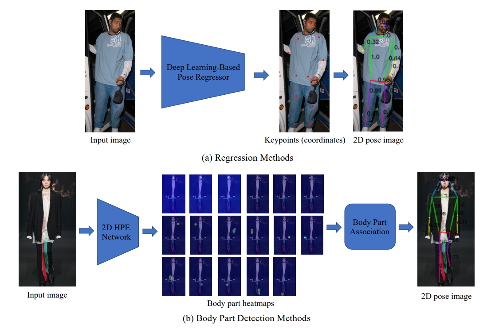
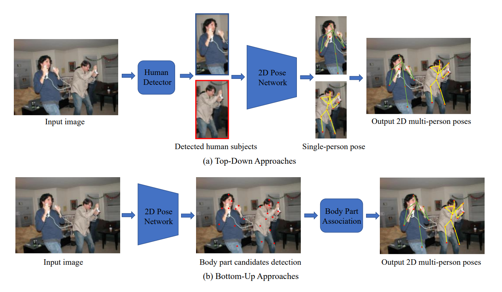
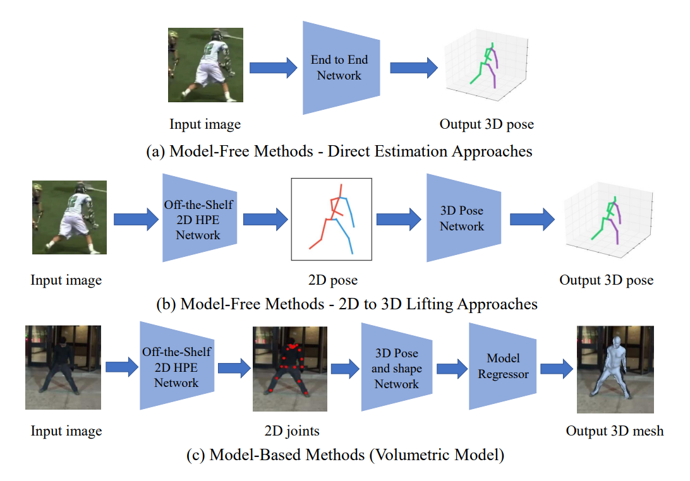
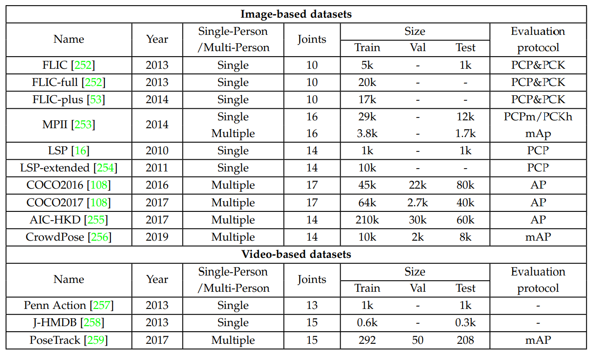
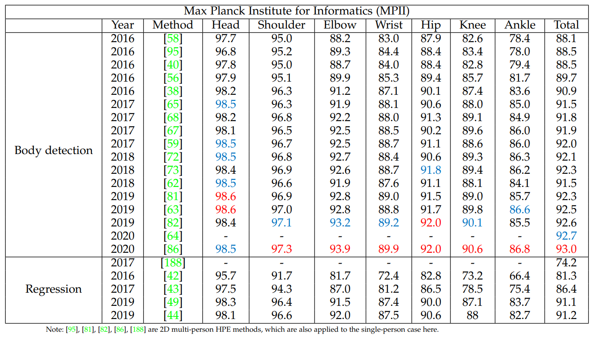
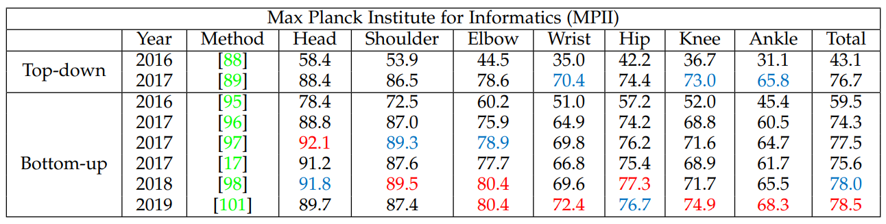
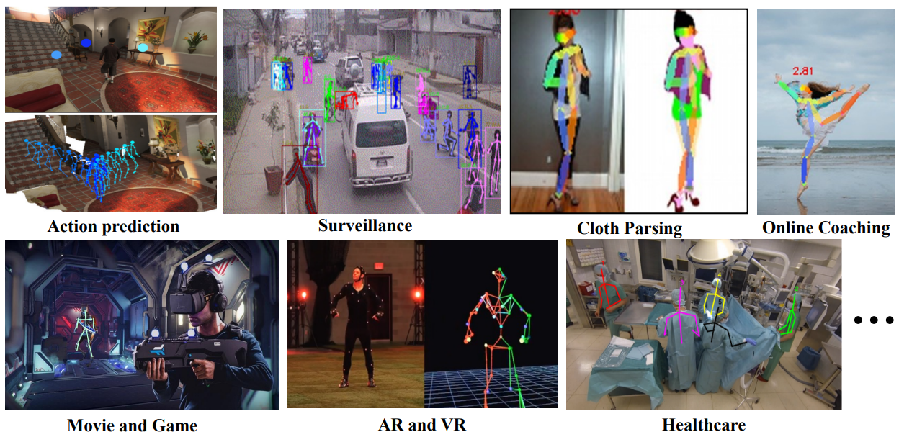

# Deep Learning-Based Human Pose Estimation: A Survey

------

原文链接：[点这里](https://arxiv.org/abs/2012.13392)

定期更新的project：[点这里](https://github.com/zczcwh/DL-HPE)

## 目录

- [1. 摘要](#1)
- [2. 介绍](#2)
- [3. 人体建模](#3)
  - [3.1 运动学模型](#3.1)
  - [3.2 平面模型](#3.2)
  - [3.3 体积模型](#3.3)
- [4. 2D人体姿态估计](#4)
  - [4.1 2D单人姿态估计](#4.1)
    - [4.1.1 回归方法](#4.1.1)
    - [4.1.2 身体部位检测方法](#4.1.2)
  - [4.2 2D多人姿态估计](#4.2)
    - [4.2.1 自顶向下方法](#4.2.1)
    - [4.2.2 自底向上方法](#4.2.2)
  - [4.3 2D HPE总结](#4.3)
- [5. 3D人体姿态估计](#5)
  - [5.1 基于单目RGB图像和视频的3D HPE](#5.1)
    - [5.1.1 单视图3D HPE](#5.1.1)
    - [5.1.2 多视图3D HPE](#5.1.2)
  - [5.2 其他来源的3D HPE](#5.2)
  - [5.3 3D HPE总结](#5.3)
- [6. 数据集和评价指标](#6)
  - [6.1 2D HPE数据集](#6.1)
    - [6.1.1 基于图像的数据集](#6.1.1)
    - [6.1.2 基于视频的数据集](#6.1.2)
  - [6.2 2D HPE评价指标](#6.2)
  - [6.3 2D HPE方法性能比较](#6.3)
  - [6.4 3D HPE数据集](#6.4)
  - [6.5 3D HPE评价指标](#6.5)
  - [6.6 3D HPE方法性能比较](#6.6)
- [7. 应用](#7)
- [8. 结论和未来方向](#8)

## 1. 摘要

人体姿态估计的目的是定位人体部位，并根据输入数据（如图像和视频）构建人体表示（如人体骨架）。其应用包括人机交互、运动分析、增强现实和虚拟现实。基于深度学习的人体姿态估计由于训练数据不足、深度模糊和遮挡而存在挑战。通过系统分析和比较，全面回顾基于深度学习的2D和3D姿态估计解决方案，还包括2D和3D人体姿态估计数据集和评价指标，性能比较。

## 2. 介绍

人体姿态估计（HPE）涉及从传感器捕获输入数据，特别是图像和视频，估计人体各部分的结构。HPE提供人体的几何和运动信息，已广泛应用于人机交互、运动分析、增强现实（AR）、虚拟现实（VR）、医疗保健等。此类方法已被证明在各种任务（包括图像分类、语义分割和目标检测）中优于经典的计算机视觉方法。遮挡、训练数据不足和深度模糊等对基于深度学习的HPE技术仍是需要克服的困难。基于深度学习的2D单人人体姿态估计已达到高性能，复杂场景中高度遮挡的多人HPE受到了广泛关注。对于3D HPE，获得精确的3D姿态标注比2D困难。运动捕捉系统可以在受控的实验室环境中采集3D姿态标注，但在自然环境中的应用有局限性。对于基于单目RGB图像和视频的3D HPE，主要挑战是深度模糊。在多视图设置中，视点关联是需要解决的关键问题。一些工程使用了诸如深度传感器、惯性测量单元（IMU）和射频设备等传感器，但这些方法通常不具有成本效益，并且需要专用硬件。

文11涵盖了带有RGB输入的3D HPE方法。文13回顾了2D HPE方法并分析了模型解释。文12总结了单目HPE从经典到基于深度学习的方法（到2019年），仅涵盖单目图像/视频中的2D HPE和3D单视图HPE。

综述分类如下：

## 3. 人体建模

人体建模是HPE的一个重要方面。大多数HPE方法使用N关节刚体运动学模型。人体是具有关节和四肢的复杂实体，包含人体运动学结构和体形信息。在典型的方法中，使用基于模型的方法来描述和推断人体姿态，并渲染2D和3D姿态。人体建模通常有三种：运动学模型（用于2D/3D HPE）、平面模型（用于2D HPE）和体积模型（用于3D HPE）。

人体建模的三种类型如下：

### 3.1 运动学模型

运动学模型也称为基于骨架的模型或运动学链模型，包括一组关节位置和肢体方向，来表示人体结构，用于捕捉不同身体部位之间的关系。图形结构模型（PSM）是一种广泛使用的图形模型，也称为树结构模型。这种灵活直观的人体模型已成功应用于2D和3D HPE。虽然运动学模型具有灵活的图形表示的优点，但它在表示纹理和形状信息方面受到限制。

### 3.2 平面模型

平面模型用于表示人体的形状和外观，身体部位通常由近似人体轮廓的矩形表示，如纸板模型。主动形状模型（ASM）广泛用于通过主成分分析捕捉整个人体图形和轮廓变形。

### 3.3 体积模型

常用的3D人体模型：SMPL、DYNA（动态人体运动模型）、缝合木偶模型、弗兰肯斯坦模型、完全可训练的端到端深度学习pipeline。

## 4. 2D人体姿态估计

2D HPE方法从图像或视频中估计人体关键点的2D位置或空间位置。传统方法采用手工特征提取技术，将人体描述为一个棍状图形，以获得全局姿态结构。基于深度学习的方法在HPE领域取得了重大突破。

### 4.1 2D单人姿态估计

2D单人姿态估计用于定位人体关节位置。如果有多个人，则首先裁剪输入图像，以便每个裁剪的图像中只有一个人。基于深度学习的单人pipelines由两类：回归方法和身体部位检测方法。回归方法用端到端框架学习从输入图像到人体关节或人体模型参数的映射。身体部位检测方法是预测身体部位和关节的大致位置，通常由heatmap表示来监督。基于heatmap的框架现在广泛应用于2D HPE任务中。

2D单人HPE方法如下：

#### 4.1.1 回归方法

DeepPose：AlexNet，传统方法转深度学习方法的开端。迭代误差反馈网络（IEF）：GoogLeNet，自校正模型，通过将预测误差注入输入空间来逐步改变初始解。合成姿态回归：ResNet-50，包含人体信息和姿态结构的重新参数化和基于骨骼的表示方法。文14：端到端的回归方法，使用soft-argmax函数在完全可微框架中将特征映射转换为关节坐标。

良好的特征表示对基于回归的方法至关重要，一种策略是多任务学习。通过在相关任务（如姿态估计和基于姿态的动作识别）之间共享表示信息，该模型可以更好地概括原始任务（姿态估计）。文46提出一个异构多任务框架，该框架由两个任务组成：1）构建回归器从完整图像中预测关节坐标；2）使用滑动窗口从图像块中检测身体部位。文47提出一种双源（即图像块和完整图像）深卷积神经网络（DS-CNN），用于两项任务：1）确定图像块是否包含身体关节的关节检测，2）确定关节在图像块中确切位置的关节定位。每项任务对应一个损失函数，两项任务的组合可以提高结果。文48学习一个多任务网络来联合处理来自视频序列的2D/3D姿态估计和动作识别。

#### 4.1.2 身体部位检测方法

身体部位检测方法旨在训练身体部位检测器来预测身体关节的位置。

将姿态估计作为热图预测问题来处理：估计K个关键点的K个热图{H1，H2，…，HK}。每个关键点热图中的像素值Hi（x，y）表示关键点位于位置（x，y）的概率。目标（或gt）热图由以gt联合位置为中心的二维高斯分布生成 。因此，通过最小化预测热图和目标热图之间的差异（例如，均方误差（MSE））来训练姿态估计网络。

与关节坐标相比，热图通过保留卷积网络的空间位置信息，为卷积网络的训练提供了更丰富的监督信息。因此，最近人们越来越有兴趣利用热图来表示关节位置，并为HPE开发有效的CNN架构。文53将基于CNN的身体部位检测器与基于部位的空间模型结合为2D HPE的统一学习框架。文55提出一种基于CNN的预测关节位置的方法。它结合关键点投票和关节概率来确定人体姿态表示。文40介绍了一种基于卷积网络的顺序框架，称为卷积姿态机（CPM），用于通过多阶段处理预测关键关节的位置（每个阶段中的卷积网络利用从先前阶段生成的2D置信图，产生身体部位位置的更加精确的预测）。文38提出一种编码器-解码器网络，在中间监督下重复自下而上和自上而下的处理。叠层沙漏（SHG）网络由pooling层和上采样层的连续组成，以捕获每个尺度的信息。之后出现很多SHG结构变体。文65设计了新的沙漏残差单元（HRU），该单元通过具有更大感受野的滤波器的侧分支扩展残差单元，捕获各种尺度的特征。文59设计一个多分支金字塔残差模块（PRM）来取代SHG中的残差单元，从而增强了深层CNN尺度的不变性。

随着GAN的出现，HPE中对其进行了探索，来生成生物学上合理的姿态配置，并区分高置信度预测和低置信度预测，从而推断出遮挡部位的潜在姿态。文67构建了一个结构感知的条件对抗网络，名为对抗PoseNet，该网络包含一个基于沙漏网络的姿态生成器和两个判别器，用于区分合理的和不合理的身体姿态。文68构建一个基于对抗性学习的网络，其中两个沙漏网络分别与判别器和生成器具有相同的结构。生成器估计每个关节的位置，判别器区分gt热图和预测热图。与基于GANs的方法不同，该方法将HPE网络作为生成器，并利用判别器提供监控，文69开发一个对抗性数据增强网络，通过将HPE网络视为判别器并使用增强网络作为生成器来执行对抗性增强，从而优化数据增强、网络训练。

除了为HPE设计高效的网络之外，还对人体结构信息进行了研究，以便为HPE网络的搭建提供更多更好的监督信息。文70为HPE设计一个端到端的CNN框架，通过整合人体各部位的空间和外观一致性，该框架能够找到难负样例。文71提出一个结构化特征级学习框架，用于推理HPE中人体关节之间的相关性，该框架捕获了更丰富的人体关节信息，提高了学习结果。文72设计一种多尺度结构感知神经网络，结合多尺度监督、多尺度特征组合、结构感知损失信息方案和关键点掩膜训练方法，以改进复杂场景中的HPE模型。文73构建一个基于沙漏的监督网络，称为深度学习的合成模型，用于描述人体各部位之间复杂而真实的关系，并学习人体中的合成模式信息（每个身体部位的方向、比例和形状信息）。文74发现并非所有部位都相互关联，因此引入了基于部位的分支网络来学习每个部位组的特定表示，而不是所有部位的共享表示。

视频序列中的人体姿态是（3D）时空信号。因此，对视频中的时空信息进行建模对于HPE非常重要。文75设计一个双分支CNN框架，将颜色和运动特征结合到帧对中，用于在HPE中构建一个表达性时空模型。文76提出一种卷积网络，该网络能够利用来自多帧的时间上下文信息，通过光流将预测的热图与相邻帧对齐。与之前基于视频的计算密集型方法不同，文60为HPE引入一种具有长短时记忆（LSTM）的循环结构，用于从不同帧捕获时间几何一致性和相关性。这种方法可以加快HPE网络的视频训练速度。文78介绍一个关键帧建议网络，用于从帧中捕获空间和时间信息，以及一个用于高效基于视频的姿态估计的人体姿态插值模块。

### 4.2 2D多人姿态估计

与单人HPE相比，多人HPE更困难、更具挑战性，因为它需要计算人数和他们的位置，以及如何为不同的人分组关键点。为了解决这些问题，多人HPE方法可以分为自顶向下和自底向上两种。自顶向下的方法使用现成的人体检测器从输入图像中获取一组框（每个框对应一个人），然后对每个人框应用单人姿态估计器来生成多人姿态。与自顶向下的方法不同，自底向上的方法首先在一张图像中定位所有身体关节，然后将它们分组到相应的目标。在自顶向下的方法中，输入图像中的人数将直接影响计算时间。自底向上方法的计算速度通常比自顶向下方法快，因为不需要分别检测每个人的姿态。

2D多人HPE方法的一般框架如下：

#### 4.2.1 自顶向下方法

自顶向下方法有两个重要部分：一个用于获取人边界框的人体检测器和一个用于预测这些边界框内关键点位置的单人姿态估计器。一些工作侧重于设计和改进HPE网络中的模块。文62在ResNet（主干网络）中添加了几个反卷积层，来构建一个简单但有效的结构，生成高分辨率表示的热图。文81提出一种新的高分辨率网络（HRNet），通过并行连接多分辨率子网络并执行重复多尺度融合来学习可靠的高分辨率表示。为了提高关键点定位的准确性，文84引入一种基于图和模型不可知的两阶段框架，称为Graph-PCNN。它由一个定位子网和一个图形姿态细化模块组成，前者用于获取粗略的关键点位置，后者用于获得精确的关键点定位表示。为了获得更精确的关键点定位，文86引入了一种残差步长网络（RSN）模块的多级网络，通过有效的层内特征融合策略学习精细的局部表示，以及姿态优化机器（PRM）模块，用于在特征中的局部和全局表示之间找到折衷。

在遮挡和截断场景下估计姿态通常发生在多人环境中，肢体重叠是不可避免的。由于遮挡或截断，人体检测器可能在自顶向下方法的第一步就会失败。因此，对遮挡或截断的鲁棒性是多人HPE方法的一个重要方面。为了实现这一目标，文88建立一个基于卷积姿态机的姿态估计器来估计关节候选。然后，他们使用整数线性规划（ILP）来解决关节与人之间的关联问题，并在严重遮挡的情况下获得人体姿态。文89设计一种新的区域多人姿态估计（RMPE）方法，用来提高HPE在复杂场景中的性能。RMPE框架由三部分组成：对称空间变换网络（用于检测不准确边界框内的单人区域）、参数姿态非极大值抑制（用于解决冗余检测问题）和姿态引导建议生成器（用于增强训练数据）。文79提出一种二阶段结构，包括一个Faster R-CNN人体检测器，为候选人体创建边界框；一个关键点估计器，使用热图偏移聚合的形式预测关键点的位置。整体方法在遮挡和杂乱场景中有良好的效果。为了缓解HPE中的遮挡问题，文90提出一种级联金字塔网络（CPN），该网络包括两部分：GlobalNet（预测眼睛或手等不可见关键点的特征金字塔网络）和RefineNet（mining loss将GlobalNet的所有级别特征与关键点相结合的网络）。结果表明，CPN在预测遮挡关键点方面有很好的性能。文91设计两个模块，Channel Shuffle Module和Spatial & Channel-wise Attention Residual Bottleneck，实现通道方面和空间信息增强，从而在遮挡场景下更好地估计多人姿态。文92开发遮挡姿态估计和校正（OPEC Net）模块，遮挡姿态数据集用来解决人群姿态估计中的遮挡问题。文93提出一个关键点对应框架，利用遮挡场景中前一帧的时间信息来恢复丢失的姿态。为了提高在稀疏标注的视频数据集中的姿态估计结果，使用自监督对网络进行训练。

#### 4.2.2 自底向上方法

自底向上方法有两个主要步骤：身体关节检测（提取局部特征并预测人体关节候选对象）；为个体身体分配关节候选对象（分组关节候选对象，使用部位关联策略构建最终姿态表示）。

文94提出一种基于R-CNN的快速身体部位检测器DeepCut，这是最早的两步自底向上方法之一。它首先检测所有候选身体部位，然后标记每个部位，并使用整数线性规划（ILP）将这些部位组合到最终姿态。但DeepCut模型的计算成本很高。文95引入DeeperCut，通过将更强大的身体部位检测器、更好的增量优化策略和图像条件下的成对项应用于身体部位分组来改进DeepCut，提高性能和速度。文17构建一个名为OpenPose的检测器，该检测器使用卷积姿态机（CPMs）通过热图和Part Affinity Fields（PAFs，一组二维向量场，带有编码肢体位置和方向的向量图）预测关键点坐标，用来将关键点与每个人关联。OpenPose大大加快了自底向上的多人HPE速度。基于OpenPose框架，文104改进了OpenPose结构，通过添加冗余边来增加PAFs中关节之间的连接，并获得了比基线方法更好的性能。尽管基于OpenPose的方法在高分辨率图像上取得了令人印象深刻的效果，但在低分辨率图像和遮挡情况下，它们的性能较差。为了解决这个问题，文100提出PifPaf方法，该方法使用部位强度场（PIF）来预测身体部位的位置，并使用部位关联场（PAF）来表示关节关联。在低分辨率和遮挡场景下，该方法优于以往基于OpenPose的方法。受OpenPose和堆叠沙漏结构的启发，文97引入单级深度网络，用来同时获得姿态检测和组分配。之后文102提出一种新的可微分层图分组（HGG）方法来学习人体部位分组。文103在文97和文81的基础上提出一种简单的HRNet扩展，称为高分辨率网络（HigherRnet），它对HRNet生成的高分辨率热图去卷积，用来解决自底向上的多人姿态估计中的尺度变化挑战。

自底向上的HPE方法也采用了多任务结构。文105引入PersonLab，将姿态估计模块和人物分割模块结合起来，用于关键点检测和关联。PersonLab由短期偏移（细化热图）、中期偏移（预测关键点）和长期偏移（将关键点分组到实例中）组成。文106提出一个多任务学习模型，该模型带有一个姿态残差网络MultiPoseNet，可以同时执行关键点预测、人体检测和语义分割任务。

### 4.3 2D HPE总结

2D单人HPE：DeepPose，堆叠沙漏网络；2D多人HPE：AlphaPose，OpenPose。

回归和身体部位检测方法在2D单人HPE中有各自的优势和局限性。回归方法可以通过端到端的框架学习从输入图像到关键点坐标的非线性映射，这提供了一种快速的学习模式和亚像素级的预测精度。但由于高度非线性的问题，通常给出的是次优解。人体部位检测方法尤其是基于热图的框架，在2D HPE中得到了更广泛的应用，因为（1）热图中每个像素的概率预测可以提高关键点定位的准确性；（2）热图通过保存空间位置信息提供更丰富的监控信息。但预测关键点的精度取决于热图的分辨率。使用高分辨率热图时，计算成本和内存占用显著增加。

对于2D多人HPE的自顶向下和自底向上方法，很难确定哪种方法更好，因为这两种方法在近期研究中都被广泛使用，各有优缺点。一方面，自顶向下的方法能产生更好的结果，因为它首先使用检测方法从图像中检测每个个体，然后使用基于单个个体的方法预测关键点的位置。在这种情况下，随着背景基本上被移除，每个检测到的人区域内的关键点热图估计变得容易。另一方面，自底向上的方法通常比自顶向下的方法更快，因为它直接检测所有关键点，并使用关键点关联策略（如亲和力链接、关联嵌入和逐像素关键点回归）将其分组为单独的姿态。

2D HPE有几个挑战需要在未来的研究中进一步解决。首先是在显著遮挡下可靠地检测个体。对于自顶向下的方法，人体检测器可能无法识别大部分重叠人体的边界。对于自底向上方法，关键点关联的难度更大。

第二是计算效率。尽管像OpenPose这样的一些方法可以在具有中等算力的特殊硬件上实现近实时处理（如在配备Nvidia GTX 1080 Ti GPU的机器上实现22 FPS），但在资源受限的设备上实现网络仍然很困难。现实世界的应用（如在线辅导、游戏、AR和VR）需要在商业设备上使用更高效的HPE方法，从而为用户带来更好的交互体验。

第三是罕见姿态数据有限。尽管2D HPE当前数据集大小对于正常姿态估计（例如站立、行走、跑步）来说足够大（如COCO数据集），但这些数据集对于异常姿态（例如坠落）的训练数据有限。数据不平衡可能会导致模型偏差，导致这些姿态的表现不佳。有效的数据生成或增强技术很有用，用来生成额外的姿态数据，用于训练更鲁棒的模型。

## 5. 3D人体姿态估计

3D HPE是一种能够预测人体关节在3D空间中位置的技术，近年来受到了广泛关注，因为它可以提供与人体相关的大量3D结构信息。有许多应用，如3D电影和动画行业、虚拟现实和在线3D动作预测等。尽管最近2D HPE取得了显著进步，3D HPE仍然是一项具有挑战性的任务。现有的大多数研究工作都是针对单目图像或视频的3D HPE，由于3D到2D的投影丢失了一维，因此是一个不适定的逆问题。当能够获得多视点或者部署了IMU和LiDAR等其他传感器时，3D HPE则是一个采用信息融合技术的适定问题。另一个限制是深度学习模型需要大量数据，并且对数据收集环境敏感。与2D人体数据集不同，在2D人体数据集中，可以轻松获得精确的2D姿态标注，但收集精确的3D姿态标注非常耗时，手动标记也不实用。此外，数据集通常是从室内环境中收集的，并带有选定的日常动作。近期工作验证了使用有偏数据集训练的模型在交叉数据集进行推理时泛化能力差的问题。

### 5.1 基于单目RGB图像和视频的3D HPE

单目相机是在2D和3D场景中应用最广泛的HPE传感器。基于单目图像和视频的深度学习2D HPE的最新进展使研究人员能够将他们的工作扩展到3D HPE。具体来说，基于深度学习的3D HPE方法分为两大类：单视图3D HPE和多视图3D HPE。

#### 5.1.1 单视图3D HPE

从单目图像和视频的单视图重建3D人体姿态是一项非常重要的任务，它会受到自身遮挡和其他目标遮挡、深度模糊、训练数据不足的影响。这是一个严重的不适定问题，因为不同的3D人体姿态可以投影到类似的2D姿态投影。此外，对于基于2D关节的方法，2D身体关节的微小定位误差可能会导致3D空间中的较大姿态失真。与单人情况相比，多人情况更加复杂。

##### A 单人3D HPE

单人3D HPE框架：

根据单人3D HPE方法是否使用人体模型来估计3D人体姿态，将其分为Model-free和model-based两类。

1）Model-free方法

Model-free方法不使用人体模型来重建3D人体表示。这些方法可进一步分为两类：（1）直接估计方法；（2）2D到3D提升方法。

直接估计：直接估计方法从2D图像推断3D人体姿态，不需要中间估计2D姿态表示。文114提出一种深度学习方法，采用浅层网络，通过同步滑动窗口和姿态坐标回归训练身体部位检测。文115提出一种后续方法，其中图像3D姿态对被用作网络输入。分数网络可以将高分分配给正确的图像3D姿态对，将低分分配给其他姿态对。然而，这些方法效率很低，因为它们需要多个前向网络推理。文43提出一种结构感知回归方法。没有使用基于关节的表示法，而是采用更稳定的基于骨骼的表示法。通过利用基于骨骼表示的3D骨骼结构定义成分损失，骨骼表示由骨骼之间的远程交互进行编码。文116通过学习3D姿态到高维潜在空间的映射，对关节之间的结构依赖进行编码。学到的高维姿态表示可以强化3D姿态的结构性约束。文117、118引入了体积表示法，将高度非线性的3D坐标回归问题转化为离散空间中可管理的形式。体积中每个关节的体素可能性由卷积网络预测。人体关节的顺序深度关系被用来缓解对精确3D gt姿态的需求。

2D到3D提升：受2D HPE的启发，2D到3D提升方法（由中间估计的2D人体姿态推断3D人体姿态）已成为3D HPE流行的解决方案。得益于SOTA2D姿态检测器的出色性能，2D到3D提升方法通常优于直接估计方法。在第一阶段中，使用现成的2D HPE模型来估计2D姿态，然后在第二阶段中使用2D到3D提升来获得3D姿态。文120从库中部署一个预测的2D姿态和3D姿态最近邻匹配。然而，如果3D姿态与给定2D姿态的图像没有条件独立，3D HPE可能会失败。文121提出一种简单但有效的全连通残差网络，以基于2D关节位置回归3D关节位置。尽管当时取得了最先进的结果，但由于过度依赖2D姿态检测器而导致重建模糊，该方法可能会失败。文122和文123使用2D热图而不是2D姿态作为估算3D姿态的中间表示。文124通过距离矩阵回归推断出3D人体姿态，其中2D和3D身体关节的距离被编码为两个欧几里德距离矩阵（EDMs）。EDM对平面内图像的旋转和平移保持不变，并且在应用归一化操作时具有缩放不变性。文125开发一种成对排序卷积神经网络（PRCNN），用于预测成对人类关节的深度排序。然后，使用由粗到精的姿态估计器从2D关节和深度排序矩阵回归3D姿态。文126、127、128首先生成多种不同的3D姿态假设，然后应用排序网络选择最佳3D姿态。

鉴于人体姿态可以表示为一个图，其中关节是节点，骨骼是边缘，因此图卷积网络（GCN）已被应用于2D到3D姿态提升问题，并表现出良好的性能。文131提出Pose2Mesh，是一种基于GCN的方法，用于从PoseNet中细化中间3D姿态。有了GCN，MeshNet就可以使用由网格拓扑构造的图形来回归网格顶点的3D坐标。文129提出一个通用框架，名为局部连接网络（LCN），利用全连接网络和GCN来编码局部关节邻域之间的关系。LCN可以克服GCN的局限性，即权重共享方案有损姿态估计模型的表示能力，并且结构矩阵缺乏灵活性，无法支持定制的节点依赖。文130也解决了GCN中所有节点卷积滤波器共享权重矩阵的局限性。为了研究语义信息和语义关系，提出了语义GCN。语义图卷积（SemGConv）操作用于学习边缘的通道权重。由于SemGConv和非局部层是交错的，所以节点之间的局部和全局关系都被捕获。

#### 5.1.2 多视图3D HPE

### 5.2 其他来源的3D HPE

### 5.3 3D HPE总结

## 6. 数据集和评价指标

数据集对HPE很重要并且是必要的，但收集全面、通用的数据集很有挑战。

### 6.1 2D HPE数据集

在深度学习进入人体姿态估计之前，有很多2D人体姿势数据集。这些数据集有两种类型：（1）上半身姿态数据集，包括Buffy Stickmen、ETHZ PASCAL Stickmen、We Are Family、Video pose 2和Sync. Activities；（2）全身姿势数据集，包括PASCAL Person
Layout、Sport和UIUC people。然而，最近只有少数工作使用这些2D HPE数据集，它们有许多局限性，如缺乏多样的物体运动、图片数量少。

2D HPE数据集介绍：

#### 6.1.1 基于图像的数据集

Frames Labeled In Cinema（FLIC）数据集：早期基于图像的2D HPE数据集之一，包含5003张图像（好莱坞电影中收集）。大约4000张用做训练集，其余用做测试集。使用Poselets的身体部位检测器，从电影中获取的完整帧集称为FLIC完整数据集。它是原始FLIC数据集的超集，包含20928个遮挡的非正样本。文53引入一个新的基于FLIC的数据集FLIC plus，该数据集删除了与FLIC测试集相同场景的所有图像。

Leeds Sports Pose（LSP）数据集：包含来自Flickr的2000张带标注的图像和8个运动标签，涵盖不同的运动项目，包括田径、羽毛球、棒球、体操、跑酷、足球、网球和排球。在LSP数据集中，每个人的全身总共有14个关节。LSP Extended扩展了LSP，仅用于训练。LSP扩展数据集拥有来自Flickr的超过10000张图像。在近期研究中，LSP和LSP扩展数据集已用于单人HPE。

Max Planck Institute for Informatics（MPII）人体姿态数据集：用于评估铰接式HPE的流行数据集。包括约25000张图像，其中包含超过4万个带标注的身体关节的个体。在文261的基础上，通过两级分层方法系统地收集图像，以捕捉日常人类活动。整个数据集涵盖410项人类活动，所有图像都有标签。每个图像都是从YouTube视频中提取的，并提供了前后未加注释的帧。此外，亚马逊Mechanical Turk上的工作人员还标记了丰富的注释，包括身体部位遮挡、三维躯干和头部方向。MPII中的图像适用于2D单人或多人HPE。

Microsoft Common Objects in Context（COCO）数据集：是使用最广泛的大型数据集。它有超过33万张图像和20万个带有关键点的标注对象，每个人都有17个关节。COCO数据集不仅用于姿态估计和分析，还用于自然环境目标检测和图像分割、上下文识别等。对于HPE，COCO数据集有两个版本：COCO keypoints 2016和COCO keypoints 2017，区别在于训练、验证和测试的划分。COCO数据集已广泛用于多人HPE工作。此外，文262提出了具有HPE全身标注的COCO全身数据集。

AI Challenger Human Keypoint Detection（AIC-HKD）数据集：是目前最大的2D HPE训练数据集。它有30万张标注图像用于关键点检测。有21万张用于训练，3万张用于验证，60多万张用于测试。这些图片来自互联网搜索引擎，主要关注人们的日常活动。

CrowdPose数据集：是在拥挤和闭塞环境下2D HPE的最新数据集之一。该数据集包含从3万张具有拥挤指数的图像中选择的2万张图像（测量满足均匀分布以此判断图像中的拥挤程度）。训练、验证和测试数据集分别有1万张、2000张和8000张。

#### 6.1.2 基于视频的数据集

Penn Action数据集：由2326个视频序列组成，其中包含15种不同的动作和人类关节标注。这些视频包含带有运动动作标注的框架：棒球场、棒球挥杆、网球正手、网球发球、板凳推举、保龄球、挺举、高尔夫挥杆、跳绳、跳高、引体向上、俯卧撑、仰卧起坐、蹲下和弹拨吉他。图像的标注使用Amazon Mechanical Turk进行标记。

Joint-annotated Human Motion Database（J-HMDB）：用于动作识别、人体检测和HPE的完全标注视频数据集。共有21个动作类别，包括刷毛、接球、拍手、爬楼梯、高尔夫、跳跃、踢球、挑、倒、上拉、推、跑、投篮、射弓、射枪、坐、站、挥棒、扔、走和挥手。共有928个视频剪辑，包括31838个带标注的帧。基于Amazon Mechanical Turk，采用2D铰接式人偶模型生成所有标注。J-HMDB数据集中70%的图像用于训练，其余用于测试。

PoseTrack数据集：用于视频分析中的多人姿态估计和关节跟踪的大型数据集。视频中的每个人都有一个带有标注的唯一跟踪ID。PoseTrack包含1356个视频序列、约46000个带标注的视频帧和276000个用于训练、验证和测试的人体姿态标注。

### 6.2 2D HPE评价指标

精确评估HPE的性能很难，因为需要考虑许多特性和要求（例如，上/全身、单/多姿态估计、人体大小）。因此有许多评价指标用于2D HPE。

Percentage of Correct Parts（PCP）：2D HPE早期工作中常用的一种测量方法，它评估棍状预测，用来报告肢体的定位精度。当预测关节和gt关节之间的距离小于肢体长度的一部分（介于0.1到0.5之间）时，确定肢体的定位。在一些工作中，PCP测量也被称为PCP@0.5，其中阈值为0.5。这一指标用于LSP数据集的单人HPE评估。然而PCP并没有在近期研究中得到广泛应用，因为它会惩罚难以检测的短肢。当模型的PCP测量值较高时，它的性能会更好。为了解决PCP的缺点，文36引入了Percentage of Detected Joints（PDJ），如果预测关节和gt关节之间的距离在躯干直径的特定部分内，则认为预测关节被检测到。

Percentage of Correct Keypoints（PCK）：用于测量给定阈值内不同关键点的定位精度。阈值设置为每个测试图像头段长度的50%，表示为PCKh@0.5。当检测到的关节和真实关节之间的距离小于躯干直径的0.2倍时，表示为PCK@0.2。PCK值越高，模型性能越好。

Average Precision（AP）和Average Recall（AR）。AP测量是根据精确度（TP结果与总TP结果的比率）和召回率（TP结果与总的gt Positive结果的比率）来衡量关键点检测准确性的指标。AP计算召回率在0到1之间的平均精度值。AP有几个类似的变种。如，在文264中引入Average Precision of Keypoints（APK）。Mean Average Precision（mAP）是所有类别的平均精度的平均值，是MPII和PoseTrack数据集上广泛使用的指标。AR是COCO关键点评估中使用的另一个指标。Object Keypoint Similarity（OKS）在目标检测中起着与IoU相似的作用，用于AP或AR。该度量是根据目标的规模以及预测点和gt点之间的距离计算的。COCO评估通常使用跨越10个OKS阈值的mAP作为评价指标。

### 6.3 2D HPE方法性能比较

2D单人HPE方法在MPII数据集上的比较：

2D多人HPE方法在MPII数据集上的比较：

值得注意的是，身体检测方法通常比回归方法具有更好的性能，因此在近期2D HPE研究中得到了更广泛的应用。

### 6.4 3D HPE数据集

### 6.5 3D HPE评价指标

### 6.6 3D HPE方法性能比较

## 7. 应用

HPE应用：

动作识别、预测、检测和跟踪：姿态信息已被用作各种应用的线索，如动作识别、预测、检测和跟踪。文274提出一种实时动作识别方法，使用的是基于姿态的算法。文275利用姿态的动态骨架模式进行动作识别。文276研究用于视频中人类行为异常检测的人体姿态图。文243使用预测的3D姿态进行长期人体运动预测。文277提出一种用于视频对齐的视图不变概率姿态嵌入方法。

基于姿态的视频监控通过监控姿态和人体网格表示而不是人类敏感身份，具有保护隐私的优点。文278嵌入带有姿态的视频，用于识别日常生活活动，以监控人类行为。

动作矫正和在线指导：一些活动，如舞蹈、体育和专业训练，需要精确的人体控制，以严格按照标准姿势进行反应。通常情况下，私人教练负责面对面地纠正姿势和指导动作。在3D HPE和动作检测的帮助下，AI私人教练只需设置摄像头，无需在场，就能让训练更加方便。文279设计一个AI教练系统，带有姿态估计模块，用于个性化的运动训练辅助。

服装解析：电子商务趋势对包括服装购买在内的各个方面都产生了显著影响。图片中的服装产品已经不能满足顾客的需求，顾客希望在穿着自己选择的服装时看到可靠的外观。衣服解析和姿态转换通过推断穿着特定衣服的人的3D外观来实现。HPE可以为布料解析提供合理的人体区域。此外，推荐系统可以通过基于所选物品的客户的可靠3D外观来评估适当性来升级。文281通过3D姿态、形状和服装风格实现了服装预测。

动画、电影和游戏：运动捕捉是动画、电影和游戏行业中呈现具有复杂运动和真实物理交互角色的关键组件。运动捕捉设备通常价格昂贵且安装复杂。HPE可以提供逼真的姿势信息，同时缓解对专业高成本设备的需求。

AR和VR：增强现实（AR）技术旨在增强数字对象在现实环境中的交互体验。虚拟现实（VR）技术的目标是为用户提供身临其境的体验。AR和VR设备使用人体姿态信息作为输入，以实现不同应用的目标。可以在真实场景中生成卡通人物来代替真实人物。文284通过3D姿态估计和人体网格恢复，从一张照片创建了3D角色动画。文285提出一种基于姿态的系统，该系统将广播网球比赛视频转换为交互式可控视频精灵。视频精灵中的玩家保留了真正专业玩家的技术和风格。

医疗保健：HPE提供定量的人体运动信息，医生可以诊断一些复杂的疾病，进行康复训练，并进行物理治疗。文286设计一个基于姿态的评估系统，用于评估帕金森病的运动严重程度。文287开发一种基于姿态的物理治疗系统，可以在家里对患者进行评估和建议。此外，可以建立这样一个系统来检测异常动作，并提前预测后续动作。如果系统确定可能发生危险，将立即发送警报。文288使用HPE算法进行坠落检测监控，以便提供即时帮助。此外，HPE方法可以为医院环境中的患者提供可靠的姿态标签，以加强对神经与自然行为相关的研究。

## 8. 结论和未来方向

HPE研究进展的几个有希望的未来方向：

HPE域适配。对于一些应用，如婴儿图像或艺术品收藏估计人类姿态，没有足够的带有gt标注的训练数据。此外，这些应用程序的数据显示出与标准姿态数据集不同的分布。在现有标准数据集上训练的HPE方法可能无法很好地推广到不同领域。最近缓解领域差距的趋势是利用基于GAN的学习方法。尽管如此，如何有效地迁移人体姿态知识、消除领域差距仍然没有得到解决。

人体模型（如SMPL、SMPL-X、GHUM&GHUML和Adam）用于对人体网格表示进行建模。然而这些模型有大量的参数。如何在保持重建网格质量的同时减少参数数量是一个有趣的问题。此外不同的人有不同的身体形状变形。更有效的人体模型可以利用其他信息（）来更好地概括。

大多数现有的方法忽略了人类与3D场景的交互。有很强的人-景关系约束可以探索，例如人类主体不能同时出现在场景中其他目标的位置。具有语义线索的物理约束可以提供可靠和逼真的3D HPE。

3D HPE用于视觉跟踪和分析。现有的基于视频的3D人体姿态和形状重建方法不平滑、不连续。一个原因是MPJPE等评价指标无法评估平滑度和真实度。应制定适当的帧级评价指标，重点关注时间一致性和运动平滑度。

现有训练良好的网络对分辨率误匹配的关注较少。HPE网络的训练数据通常是高分辨率的图像或视频，这可能导致对低分辨率输入预测不准确。对比学习方案文23（如原始图像及其低分辨率版本作为正样本对）可能有助于构建分辨率感知HPE网络。

视觉任务中的深度神经网络容易受到攻击。不可察觉的噪声会显著影响HPE的性能。很少有工作考虑对HPE的对抗性攻击。对抗性攻击防御的研究可以提高HPE网络的鲁棒性，并促进基于姿态的实际应用。

由于人体的异质性，人体各部位可能具有不同的运动模式和形状。单一的共享网络体系结构对于估计具有不同自由度的所有身体部位来说可能不是最佳方案。神经结构搜索（NAS）能够搜索到用于估计每个身体部位的最佳结构。此外NAS还可以用于发现高效的HPE网络体系结构，以降低计算成本。当必须面对多个目标（如延迟、准确性和能耗）时，在HPE中探索多目标NAS也是值得的。

