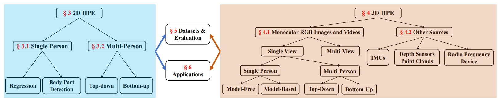
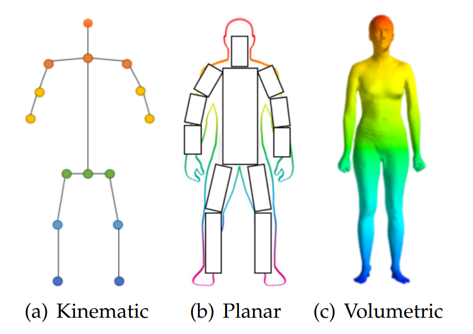

# Deep Learning-Based Human Pose Estimation: A Survey

------

原文链接：[点这里](https://arxiv.org/abs/2012.13392)

## 目录

- [1. 摘要](#1)
- [2. 介绍](#2)
- [3. 人体建模](#3)
  - [3.1 运动学模型](#3.1)
  - [3.2 平面模型](#3.2)
  - [3.3 体积模型](#3.3)
- [4. 2D人体姿态估计](#4)
  - [4.1 2D单人姿态估计](#4.1)
  - [4.2 2D多人姿态估计](#4.2)
  - [4.3 2D HPE总结](#4.3)
- [5. 3D人体姿态估计](#5)
  - [5.1 基于单目RGB图像和视频的3D HPE](#5.1)
  - [5.2 其他来源的3D HPE](#5.2)
  - [5.3 3D HPE总结](#5.3)
- [6. 数据集和评价指标](#6)
  - [6.1 2D HPE数据集](#6.1)
  - [6.2 2D HPE评价指标](#6.2)
  - [6.3 2D HPE方法性能比较](#6.3)
  - [6.4 3D HPE数据集](#6.4)
  - [6.5 3D HPE评价指标](#6.5)
  - [6.6 3D HPE方法性能比较](#6.6)
- [7. 应用](#7)
- [8. 结论和未来方向](#8)

## 1. 摘要

人体姿态估计的目的是定位人体部位，并根据输入数据（如图像和视频）构建人体表示（如人体骨架）。其应用包括人机交互、运动分析、增强现实和虚拟现实。基于深度学习的人体姿态估计由于训练数据不足、深度模糊和遮挡而存在挑战。通过系统分析和比较，全面回顾基于深度学习的2D和3D姿势估计解决方案，还包括2D和3D人体姿态估计数据集和评价指标，性能比较。

## 2. 介绍

人体姿态估计（HPE）涉及从传感器捕获输入数据，特别是图像和视频，估计人体各部分的结构。HPE提供人体的几何和运动信息，已广泛应用于人机交互、运动分析、增强现实（AR）、虚拟现实（VR）、医疗保健等。此类方法已被证明在各种任务（包括图像分类、语义分割和目标检测）中优于经典的计算机视觉方法。遮挡、训练数据不足和深度模糊等对基于深度学习的HPE技术仍是需要克服的困难。基于深度学习的2D单人人体姿势估计已达到高性能，复杂场景中高度遮挡的多人HPE受到了广泛关注。对于3D HPE，获得精确的3D姿态标注比2D困难。运动捕捉系统可以在受控的实验室环境中采集3D姿态标注，但在自然环境中的应用有局限性。对于基于单目RGB图像和视频的3D HPE，主要挑战是深度模糊。在多视图设置中，视点关联是需要解决的关键问题。一些工程使用了诸如深度传感器、惯性测量单元（IMU）和射频设备等传感器，但这些方法通常不具有成本效益，并且需要专用硬件。

文11涵盖了带有RGB输入的3D HPE方法。文13回顾了2D HPE方法并分析了模型解释。文12总结了单目HPE从经典到基于深度学习的方法（到2019年），仅涵盖单目图像/视频中的2D HPE和3D单视图HPE。

综述分类如下：

## 3. 人体建模

人体建模是HPE的一个重要方面。大多数HPE方法使用N关节刚体运动学模型。人体是具有关节和四肢的复杂实体，包含人体运动学结构和体形信息。在典型的方法中，使用基于模型的方法来描述和推断人体姿态，并渲染2D和3D姿态。人体建模通常有三种：运动学模型（用于2D/3D HPE）、平面模型（用于2D HPE）和体积模型（用于3D HPE）。

人体建模的三种类型如下：

### 3.1 运动学模型

运动学模型也称为基于骨架的模型或运动学链模型，包括一组关节位置和肢体方向，来表示人体结构，用于捕捉不同身体部位之间的关系。图形结构模型（PSM）是一种广泛使用的图形模型，也称为树结构模型。这种灵活直观的人体模型已成功应用于2D和3D HPE。虽然运动学模型具有灵活的图形表示的优点，但它在表示纹理和形状信息方面受到限制。

### 3.2 平面模型

平面模型用于表示人体的形状和外观，身体部位通常由近似人体轮廓的矩形表示，如纸板模型。主动形状模型（ASM）广泛用于通过主成分分析捕捉整个人体图形和轮廓变形。

### 3.3 体积模型

## 4. 2D人体姿态估计

### 4.1 2D单人姿态估计

### 4.2 2D多人姿态估计

### 4.3 2D HPE总结

## 5. 3D人体姿态估计

### 5.1 基于单目RGB图像和视频的3D HPE

### 5.2 其他来源的3D HPE

### 5.3 3D HPE总结

## 6. 数据集和评价指标

### 6.1 2D HPE数据集

### 6.2 2D HPE评价指标

### 6.3 2D HPE方法性能比较

### 6.4 3D HPE数据集

### 6.5 3D HPE评价指标

### 6.6 3D HPE方法性能比较

## 7. 应用

## 8. 结论和未来方向
