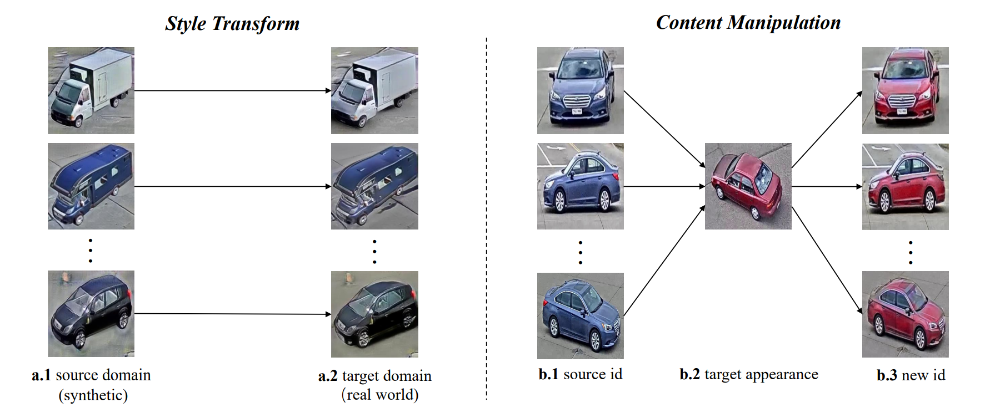
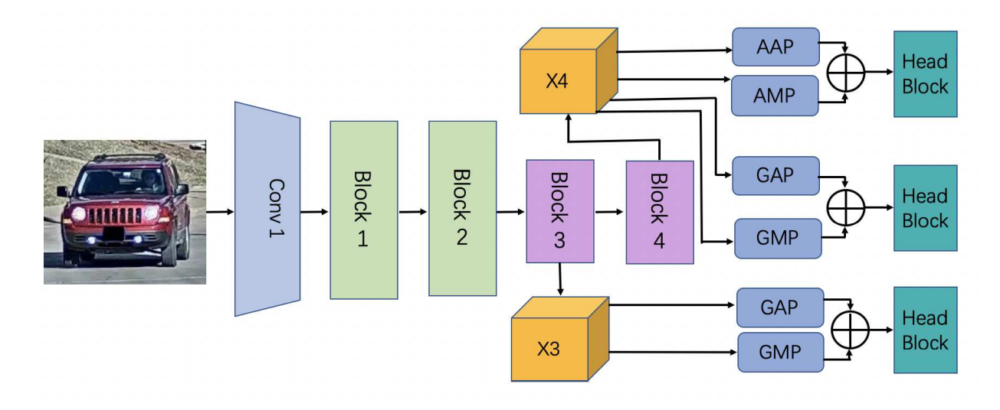
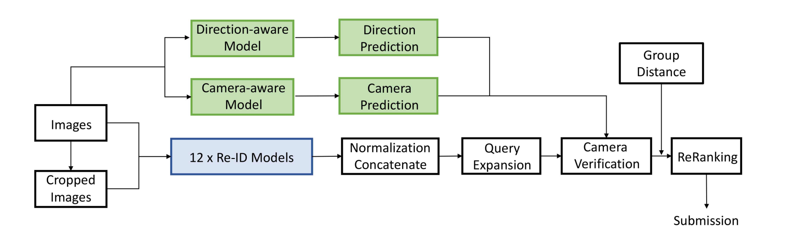

# Going Beyond Real Data: A Robust Visual Representation for Vehicle Re-identification

------

原文链接：[点这里](https://openaccess.thecvf.com/content_CVPRW_2020/papers/w35/Zheng_Going_Beyond_Real_Data_A_Robust_Visual_Representation_for_Vehicle_CVPRW_2020_paper.pdf)

## 目录

- [1. 摘要](#1)
- [2. 介绍](#2)
- [3. 相关工作](#3)
- [4. 方法](#4)
  - [4.1 合成数据](#4.1)
  - [4.2 表示学习](#4.2)
  - [4.3 后处理](#4.3)
- [5. 实验](#5)
  - [5.1 数据分析](#5.1)
  - [5.2 定量结果](#5.2)
  - [5.3 定性结果](#5.3)
- [6. 总结](#6)

## 1. 摘要

专注于真实场景开发一个鲁棒性的车辆reid系统。充分利用合成数据的优点，同时配备真实图像，为不同的视点和光照条件下的车辆学习一个鲁棒性的表示。通过对各种数据增强方法和常用的强基线的综合调查和评价，分析了制约车辆重识别性能的瓶颈。基于分析，设计了一种具有更好的数据增强、训练和后处理策略的车辆reid方法。所提方法在41个团队中获得了第1名，在私有测试集上有84.13%的mAP。

## 2. 介绍

智能交通系统(ITS)可以应用于现代城市中的现实问题。如通过估计交通流特性和自适应调整交通灯来优化交通设计，最大化交通能力。此外还提供了道路和周围环境的全面信息，通过检测车辆和行人，以及估计他们的运动，为自动驾驶系统生成驾驶政策。

ITS感知系统通常包括以下功能，检测交通要素，跟踪要素，计算交叉路口的车辆总数以及估计车辆姿态。车辆reid是ITS中最关键的组件之一，可以在不同时间甚至是在不同相机捕获的帧中查找同一车辆。

传统的reid方法首先在帧中独立检测目标，然后进行特征提取，总结出感兴趣目标的外观特征。由于图像中存在遮挡、噪声检测、不同光照条件和视点变化等问题，鲁棒的外观特征提取方法非常需要在不同的帧中表示相同的目标。有些方法使用目标的统计特征，如颜色直方图或梯度直方图（HOG）来提高特征表示的鲁棒性。然而，在许多具有挑战性的情况下，手工制作的统计特征不能表示在不同的视图和光照条件下或有遮挡的目标。

基于深度神经网络的reid方法已经证明优于传统的reid方法。一般来说，大多数都是由一个孪生(Siamese)网络和一个度量学习目标训练而成，如三元组损失（triplet loss），N-pair损失（N-pair loss）和角损失（angulate loss）。具体来说，这些目标旨在最小化来自同一辆车的特征表示之间的距离，同时区分不同车辆的特征表示。利用车辆类型、颜色和车辆姿态等额外信息设计reid网络结构可以进一步提高识别性能。还引入了各种图像生成方法来提高reid系统的性能。例如，引入域随机化，通过绘制具有指定姿态和颜色的车辆三维模型来生成图像。在文39中，GAN被证明是为reid系统生成训练数据的一种有效方法。

本文在真实场景中设计一个高精度的车辆reid系统。要解决三个主要问题：1）如何有效、高效地设计车辆reid网络；2）如何结合特定任务的信息进一步提高测试过程中的检索性能；3）给定多个reid网络，如何进一步提高reid性能。

## 3. 相关工作

车辆reid的最新进展主要得益于CNN学习的视觉深度表示。文13表示该领域已经提出有效的损失函数、采样策略等训练技术。例如，Liu等人将CNN特征与传统手工制作的特征融合，产生鲁棒的视觉表示。为了挖掘细粒度模式，Wang等人首先对车辆图像的关键点进行标注，挖掘基于部件的车辆特征。Shen等人利用车辆通常在短时间内会在相机下重新出现的先验知识，利用时空约束去除难负样本。

同时，车辆reid方法还利用了其他相关任务的经验，即行人reid和人脸识别，例如center loss，空间转换器和batch normalization neck。然而，现实中的车辆reid仍然是一项具有挑战性的任务，因为不同的相机、车辆方向、光照和遮挡会导致视觉外观发生较大的变化。

为了减少变异和学习鲁棒性的车辆表示，许多最近的工作已经探索了数据生成方法。如游戏引擎，证明合成数据用于训练reid网络是有效的。Zhou等人提出针对方向变化问题变换单视图特征来合成多视图特征，而Yao等人利用图形引擎来增广不同方向和属性的真实数据集。

最近，生成对抗网络（GAN）被广泛用于数据生成，不仅可以将图像样本的风格从源域转移到目标域，还可以生成具有特定属性的样本。本文探索了不同的数据增强方法，并允许模型”看到“更多的车辆变体，从而产生鲁棒性的视觉表示。

## 4. 方法

首先探讨数据生成方法，然后进行表示学习。在推理过程中，从训练好的模型中提取出视觉表示，并执行后处理方法。

### 4.1 合成数据

##### 风格转换

与经典的车辆reid数据不同，AICity-Flow由真实数据和合成数据组成。虽然合成数据中的id来自于真实世界，但合成图像与真实图像仍然存在明显的风格差异，即众所周知的域差距。为了解决这一问题，本文采用图像转换技术。像CycleGAN一样的框架，即UNIT，使用真实数据和合成数据作为两个不同的来源进行训练。在训练时输入图像需要在两个源之间转换。训练后将所有合成图像按照合成→真实方向进行转换，得到更加真实的样本，减小分布差距。

##### 内容操作

上面提到的样式转换方法不会改变图像内容。生成的数据在视觉外观上仍然接近原始输入，这可能限制了对合成数据的学习。为此还尝试通过内容操作生成新数据。DGNet是一种新颖的框架，可以生成具有不同视觉外观的样本，对reid任务特别有效。使用两个编码器分别负责外观和结构信息，而解码器根据外观和结构特征生成图像。在本文中，DG-Net在AICity Challenge提供的车辆reid数据集上进行训练。然后利用训练好的模型生成新的id。给定两种不同颜色的id图像，DG-Net将生成具有目标外观的新图像。为了避免由于相似的id引起的歧义以及由于低分辨率图像导致失败案例，在高分辨率子集上生成数据集。此外，为了使生成的数据具有一致的外观，只选择一个目标图像，为整个源图像提供外观嵌入。生成的数据只在微调阶段使用。

##### 复制和粘贴

还探索了直接的方法增广训练数据， 如复制粘贴，让模型“看到”更多的背景变量。将真实图像的前景与合成图像的背景相结合来生成新样本。 通过实例分割方法从真实图像中分割出前景车辆。应用DeepFill v2在去除前景的空白区域进行背景图像修复。 应用无缝图像克隆来融合前景和背景图像。

### 4.2 表示学习

##### 网络结构

根据现有的re-id工作，把在ImageNet上预先训练的SOTA网络作为骨干模块，包括ResNeXt101、ResNeXt101_32x8l_wsl和ResNet50_IBN_a。部署开源网络结构变体有：

vanilla reid基线将ImageNet的原始分类层替换为一个新的分类器模块。新的分类器模块包含一个全连接层fc1、一个BN层和一个全连接层fc2。fc1层将学习到的特征压缩到512维，fc2层作为线性分类器来输出类别预测。在推理时，提取fc2层之前的512维特征作为视觉表示。

另一个复杂的reid网络体系结构，融合了多尺度信息以增强车辆表示。下图简要说明了该网络结构。

采用ResNet主干的最后两个块（即块3和块4）的激活。将这两个特征分别表示为X3和X4。全局平均池化（GAP）和全局最大池化（GMP）用于获得全局表示。在X4上执行输出大小为2×2的自适应平均池化（AAP）和自适应最大池化（AMP），以获得局部表示。X3_g_avg表示X3的全局平均池化特征，X4_a_max表示X4的自适应最大池化特征。同样还获得了X3_g_max、X4_g_avg、X4_g_max和X4_a_avg。所有上述输出特征都受到ranking loss的监督，以拉近相同id的样本，区分不同id的样本。X3_g_avg和X3 g_max被进一步送至head模块，X4_g_avg和X4_g_max、X4_a_avg和X4_a_avg也被送至head模块。head模块：BN1+leaky-relu+Conv+BN2+fc，用于预测车辆身份。交叉熵损失用于惩罚错误预测。

##### 优化函数

部署了两个广泛适用的函数，即cross-entropy loss和ranking loss来优化模型。N表示为数据集中车辆id的数量。给定输入图像x和相应的标签y，交叉熵损失将惩罚错误的类别预测。

ranking loss主要是优化训练样本之间的距离。将正确图像对的特征拉近，同时不同车辆id的样本特征拉远。给定三元组{xa，xp，xn}，xa和xp是同一车辆的样本，而xa和xn具有不同的id。

##### 负样本挖掘

为了提高学习模型的辨别能力，我们采用了离线负样本挖掘步骤对模型进行微调。包括两个阶段，即负样本挖掘和规则训练。在负样本挖掘阶段，从mini-batch中随机抽取50%的图像，然后选择最相似的负样本对组成hard-negative training triplet。因此，可以获得接近决策边界的具有挑战性的训练样本来帮助模型学习。第二阶段是像往常一样使用ranking loss训练模型。

##### 辅助信息学习

车辆reid模型很容易被方向相似的不同样本混淆。为了克服这一缺点，本文采用方向分类模型来预测每辆车的方向，并在后处理阶段根据方向相似性抑制一些车辆对。该网络和相应的注释扩展训练集已于2019年AICity Challenge中发布。方向分类模型简单有效，遵循标准分类网络体系结构。选择ResNet50作为主干，然后是一个全局平均池化层。采用dropout操作避免过拟合。然后叠加Conv层和BN层降低特征维数。最后，一个fc层将特征映射为预定义的方向数。在测试阶段，每个图像由方向分类模型得到方向概率向量。最后使用两个方向概率向量的点积来表示一对图像的方向相似性。此外还训练了一个摄像头感知模型来预测摄像头捕捉车辆图像的位置。摄像头感知模型与方向感知模型相结合，实现后处理中的摄像头验证。

##### 实施细节

训练通用配置：略。

无缝图像克隆：将车辆区域从前景图像复制到背景图像上，以消除视觉干扰接缝。

##### 微调模型

为了使模型更适应现实世界，在标准的训练过程之后，模型以较小的学习率对现实世界的数据进行进一步的微调。由于真实数据的类别数小于合成数据的真实数据的类别数，因此使用新的分类器层替换训练模型的分类器。微调阶段采用一种预热策略，该策略首先优化新的分类器层，同时固定主干网络。然后对网络中的所有参数进行微调。除了来自原始数据集的数据外，还利用DG-Net生成的数据以及裁剪的数据，为后处理中的模型集成微调不同的模型。

### 4.3 后处理

部署几种后处理技术促进最终的检索结果。包括图像对齐、模型集成、查询扩展、重排序、摄像头验证和组距离。

##### 图像对齐

数据集提供一个相对宽松的边界框时可能会引入额外的背景。因此使用MaskRCNN重新检测车辆。在原始图像和裁剪图像之间对车辆表示进行平均，以获得更鲁棒的车辆表示。

##### 模型集成

采用文38中的类似策略进行特征级别的集成。将来自12个不同模型的标准化特征连接起来作为最终的视觉表示。

##### 查询扩展&重新排序

采用无监督聚类方法，即DBSCAN，寻找最相似的样本。查询特征更新为同一集群中其他查询的平均特征。低分辨率图像可能会影响特征识别能力。因此在计算平均特征时不涉及低分辨率图像的特征。此外还采用了re-ranking方法细化最终结果，考虑了高置信度的候选图像。本方法没有修改重新排序的程序，而是通过从“看到”的各种汽车中提取知识来获得有区别的车辆特征。有了更好的功能，重新排名更有效。

##### 摄像头验证

利用摄像头验证进一步去除一些难负样本。训练几个摄像头感知CNN模型来识别拍摄车辆图像的摄像头。测试时从训练模型中提取摄像头预测和感知特征，然后对这些特征进行聚类。假设查询图像和目标图像是在不同的摄像机中拍摄的。在给定一幅查询图像的情况下，从候选图像（图库）中减少相同摄像头预测或相同摄像头簇中心图像的相似性。此外，如文25所示，观察到摄像头#6、#7、#8、#9位于十字路口，车辆的方向大部分不同。而训练数据只包含场景1、3、4中的真实图像，而没有摄像头#6、#7、#8、#9。因此在推理时假设低摄像头预测置信度的图像来自#6、#7、#8、#9。本文不对测试数据使用任何额外的摄像头注释。基于这个假设进一步添加一个方向约束，即查询图像和目标图像也应该具有不同的方向预测。

##### 组距离

AICity Challenge提供了车辆的轨迹信息，与现实场景非常接近。在实际应用中，可以在同一摄像头下通过车辆检测和跟踪算法获得轨迹。为了充分利用这些信息，引入以下两个假设：1）来自同一轨迹的图像属于同一辆车，并且可以共享视觉表示，以增强单个图像表示的可扩展性；2） 同一摄像头下的不同轨迹来自不同的车辆。基于第一个假设，采用图库扩展，将图库特征更新为同一轨迹中其他图像的平均特征。基于第二个假设，引入了一种积极的策略来减少难负样本的相似性。鉴于从摄像头C检索到的高置信度图像，降低了同一摄像机C中不同轨迹的相似性分数。

## 5. 实验

### 5.1 数据分析

### 5.2 定量结果

### 5.3 定性结果

## 6. 总结

